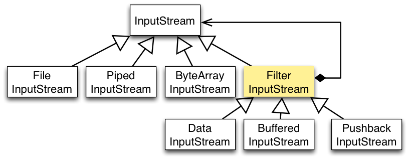

# 计算机网络

>主要分成三个大部分，一是课上学的整体框架知识，二是HTTP协议，三是TCP/UDP/IP


# 操作系统

>在课上基础知识基础上，还需要对线程、进程、内存空间有更近一步的了解。比方说常用内存分配方式、死锁等等哦


# 数据结构&算法

## 算法

>这一块得多做做题，目前比较推荐的有代码随想录、剑指Offer，目前代码随想录一刷、剑指Offer I 一刷，剑指Offer Ⅱ 做了一半，继续努力

### 排序算法

#### 冒泡排序

### 大数相乘尾0

#### 1.舍弃高位的做法

采用取模的方法把高位给去掉

#### 2.使用因式分解

```java
public class Main {
    // n代表即将输入的数组大小
    // 要求的是[1,1] [1,2]...[1,n]...[2,2] [2,3]...[2,n]...[n-1,n]
    public static void main(String[] args) {
        Scanner cin = new Scanner(System.in);
        // 数字的数量
        int n = cin.nextInt();
        long[] aCount2 = new long[n];
        long[] aCount5 = new long[n];
        // 计算每个元素因式中2和5的个数
        for (int i = 0; i < n; i++) {
            long ai = cin.nextLong();
            long tmp = ai;
            while (tmp % 2 == 0) {
                tmp /= 2;
                aCount2[i]++;
            }
            tmp = ai;
            while (tmp % 5 == 0) {
                tmp /= 5;
                aCount5[i]++;
            }
        }
        long ans = 0L;
        for (int i = 0; i < n; i++) {
            long tmp2i = aCount2[i];
            long tmp5i = aCount5[i];
            ans += Math.min(tmp2i, tmp5i);
            for (int j = i + 1; j < n; j++) {
                tmp2i += aCount2[j];
                tmp5i += aCount5[j];
                ans += Math.min(tmp2i, tmp5i);
            }
        }
        System.out.println(ans);
    }
}
```

#### 3.BigInteger

存储数据的时候采用的是int数组，相比于CPU内部存储采用补码的方式，BigInteger没有使用补码可能出于以下考虑：第一是已经通过sigNum标志正负数，判断0也很方便，不像CPU使用反码表示时，0的表示方法有11111111和00000000两种；第二是，如果使用补码进行存储，在乘法等操作时比较复杂（原码、补码的乘法方式有异）。

```java
BigInteger x = new BigInteger("12345678987654321234567898765432123456789");
BigInteger y = new BigInteger("98765432123456789876543212345678987654321");
System.out.println(x.multiply(y));
```

单独的算大数相乘的尾0的话，这样就可以了：

```java
public static int Method3(BigInteger x, BigInteger y){
    int ans = 0;
    x = x.multiply(y);
    System.out.println(x);
    BigInteger big10 = new BigInteger("10");
    BigInteger big0 = new BigInteger("0");
    while (!x.equals(big0) && x.mod(big10).equals(big0)) {
        ans++;
        x = x.divide(big10);
    }
    return ans;
}
```

### 单调栈

>`接雨水`：做这道题可以用单调递减（从栈底到栈顶，栈顶放的是小元素，栈顶放的是大元素）的栈，遇到新的值可能比栈内元素大，我们就把栈内所有比它小（或者等于但是具体处理细节不太一样）的值都pop出去就ok啦！
>
>`每日温度`：koko
>
>要点就是按元素下标构建单调栈，非常好用。利用下标进行运算，具体题目具体要求。

### KMP

>1. 求next数组
>
>  ```java
>public void getNext(char[] pattern) {
>    int j = -1;
>    next[0] = j;
>    for (int i = 1; i < pattern.length; i++) {
>        while(j >= 0 && pattern[i] != pattern[j+1]) j = next[j];
>        if(pattern[i] == pattern[j+1]) j++;
>        next[i] = j;
>    }
>}
>  ```
>
>2. 求解模板串在文本串中的位置
>
>  ```java
>public int strStr(char[] text, char[] pattern) {
>	int j = -1;
>    for(int i = 0; i < text.length; i++) {
>        while(j >= 0 && text[i] != pattern[j+1]) j = next[j];
>        if(j && text[i] == pattern[j+1]) j++;
>        if(j == pattern.length - 1); return j;
>    }
>    return -1;
>}
>  ```
>
>

### top-K

>以求前k小为例，大致上可以分为三种方法
>
>1. 整个数组排序
>2. 使用优先队列（小顶堆、大顶堆
>3. 快排子步骤：partition

#### 1.Arrays.sort直接全部排序

```java
int[] ans = new int[k];
if (k == 0) return ans;
Arrays.sort(arr);
for (int i = 0; i < k; i++) {
    ans[i] = arr[i];
}
return ans;
```

#### 2.PriorityQueue堆排序

```java
int[] ans = new int[k];
if (k == 0) return ans;
// 构造大顶堆，默认是小顶堆
PriorityQueue<Integer> heap = new PriorityQueue<>(Comparator.reverseOrder());
for (int i = 0, len = arr.length; i < len; i++) {
    int size = heap.size();
    // 比arr[i]大就得弹出去了，说明肯定不是前k小的
    if (size == k && heap.peek() <= arr[i]) continue;
    if (size == k) heap.poll();
    heap.offer(arr[i]);
}
for (int i = 0; i < k; i++) {
    ans[i] = heap.poll();
}
return ans;
```

#### 3.quickSort子步骤

```java
private static final Random random = new Random(System.currentTimeMillis());

public int[] smallestK(int[] arr, int k) {
    if (k == 0) {
        return new int[0];
    }

    int len = arr.length;
    int left = 0;
    int right = len - 1;
    // 找下标是 k - 1 的那个数，由于在循环过程中 left <= right 一定成立，因此写 while (true)  就可以
    while (true) {
        int index = partition(arr, left, right);
        if (index == k - 1) {
            break;
        } else if (index < k - 1) {
            left = index + 1;
        } else {
            right = index - 1;
        }
    }

    int[] res = new int[k];
    System.arraycopy(arr, 0, res, 0, k);
    return res;
}

private int partition(int[] arr, int left, int right) {
    // 随机选择 arr[left..right] 中的元素作为 pivot，为什么传 right - left + 1 请见代码后的「说明」
    int randomIndex = left + random.nextInt(right - left + 1);
    swap(arr, left, randomIndex);

    // 保持循环不变的性质：lt 是 less than 的缩写
    // arr[left + 1..lt] < pivot
    // arr(lt..i) >= pivot
    int lt = left;
    int pivot = arr[left];
    for (int i = left + 1; i <= right; i++) {
        if (arr[i] < pivot) {
            lt++;
            swap(arr, i, lt);
        }
    }

    // 这一步比较容易忘掉，必须要交换以后返回 lt
    swap(arr, left, lt);
    return lt;
}

private void swap(int[] arr, int index1, int index2) {
    int temp = arr[index1];
    arr[index1] = arr[index2];
    arr[index2] = temp;
}
```

### LRU

>LRU是最近最少使用的意思，意味着当加入某个数据时，如果当前的缓存空间已经到达上限，需要删除最长时间没有使用的数据。具体来说，LRU需要实现两个方法，且get方法和put方法都以O(1)的平均时间复杂度运行。
>
>由此可以想到相关的满足get方法的数据结构有数组和哈希表，满足put方法的数据结构有链表。又考虑到对象以键值对的形式存储，哈希表自然是不可缺少，所以还是可以想到哈希表组合链表的数据结构。

#### 1.LinkedHashMap实现

```java
class LRUCache {
    private int capacity;
    private LinkedHashMap<Integer, Integer> cache;

    public LRUCache(int capacity) {
        this.capacity = capacity;
        cache = new LinkedHashMap<>(capacity,0.75F ,true){
            @Override
            protected boolean removeEldestEntry(Map.Entry<Integer, Integer> eldest) {
                return size() > capacity;
            }
        };
    }
    public int get(int key) {
        return cache.getOrDefault(key, -1);
    }
    public void put(int key, int value) {
        cache.put(key,value);
    }
}
```

#### 2.哈希表+双向链表实现

```java
class LRUCache {
    class DLinkedNode {
        int key;
        int value;
        DLinkedNode prev;
        DLinkedNode next;
        public DLinkedNode() {}
        public DLinkedNode(int _key, int _value) {key = _key; value = _value;}
    }

    private Map<Integer, DLinkedNode> cache = new HashMap<Integer, DLinkedNode>();
    private int size;
    private int capacity;
    private DLinkedNode head, tail;

    public LRUCache(int capacity) {
        this.size = 0;
        this.capacity = capacity;
        // 使用伪头部和伪尾部节点
        head = new DLinkedNode();
        tail = new DLinkedNode();
        head.next = tail;
        tail.prev = head;
    }

    public int get(int key) {
        DLinkedNode node = cache.get(key);
        if (node == null) {
            return -1;
        }
        // 如果 key 存在，先通过哈希表定位，再移到头部
        moveToHead(node);
        return node.value;
    }

    public void put(int key, int value) {
        DLinkedNode node = cache.get(key);
        if (node == null) {
            // 如果 key 不存在，创建一个新的节点
            DLinkedNode newNode = new DLinkedNode(key, value);
            // 添加进哈希表
            cache.put(key, newNode);
            // 添加至双向链表的头部
            addToHead(newNode);
            ++size;
            if (size > capacity) {
                // 如果超出容量，删除双向链表的尾部节点
                DLinkedNode tail = removeTail();
                // 删除哈希表中对应的项
                cache.remove(tail.key);
                --size;
            }
        }
        else {
            // 如果 key 存在，先通过哈希表定位，再修改 value，并移到头部
            node.value = value;
            moveToHead(node);
        }
    }

    private void addToHead(DLinkedNode node) {
        node.prev = head;
        node.next = head.next;
        head.next.prev = node;
        head.next = node;
    }

    private void removeNode(DLinkedNode node) {
        node.prev.next = node.next;
        node.next.prev = node.prev;
    }

    private void moveToHead(DLinkedNode node) {
        removeNode(node);
        addToHead(node);
    }

    private DLinkedNode removeTail() {
        DLinkedNode res = tail.prev;
        removeNode(res);
        return res;
    }
}
```

### N皇后

    class Solution {
        private int ans = 0;
        // 某一层放在某个位置
        private HashMap<Integer, Integer> map = new HashMap<>();
    
        private void backTrack(int n, int curLayer) {
            if (n == curLayer) {
                ans++;
                return;
            }
    
            for (int i = 0; i < n; i++) {
                // 当前列被用过
                if (map.containsValue(i))
                    continue;
                boolean flag = true;
                for (int j = 0; j < curLayer; j++) {
                    // 第j层所使用列，说明不满足条件
                    int val = map.get(j);
                    if (val == i - curLayer + j || val == i + curLayer - j) {
                        flag = false;
                        break;
                    }
                }
                if (flag) {
                    map.put(curLayer, i);
                    backTrack(n , curLayer + 1);
                    map.remove(curLayer);
                }
            }
        }
    
        public int totalNQueens(int n) {
            backTrack(n, 0);
            return ans;
        }
    }


### N数之和

1. 暴力dfs嘛，时间复杂度相当高勒
2. 小小优化，当最终到达二数之和时使用神奇双指针
3. 递归+双指针+后缀和剪枝！神奇连招，这个得整点代码

```c++
class Solution {
    vector<long long> postsum;
    void init(vector<int>& nums) {           // (1)
        int i, n = nums.size();
        postsum.resize(n + 1);
        postsum[n] = 0;
        sort(nums.begin(), nums.end());
        for(i = n-1; i >= 0; --i) {
            postsum[i] = postsum[i+1] + nums[i];
        }
    }

    vector<vector<int>> nSum(int n, vector<int> & nums, int l, int r, int target) {
        vector <vector<int> > ret;
        int i, j;
        if(n == 1) {                         // (2)
            for(i = l; i <= r; ++i) {
                if(nums[i] == target) {
                    ret.push_back({target});
                    break;
                }
            }
            return ret;
        }
        if(n == 2) {
            while(l < r) {
                int now = nums[l] + nums[r];
                if(now > target) {
                    --r;
                }else if(now < target) {
                    ++l;
                }else {
                    ret.push_back( {nums[l], nums[r]});
                    ++l;
                    --r;
                    while(l < r && nums[l] == nums[l-1]) ++l;
                    while(l < r && nums[r] == nums[r+1]) --r;
                }
            }
        }
        for(i = l; i <= r - (n-1); ++i) {
            if(i > l && nums[i] == nums[i-1]) {
                continue;
            }
            if(nums[i] + postsum[r - (n-1) + 1] < target) {
                continue;                    // (3)
            }
            if(postsum[i] - postsum[i+n] > target) {
                break;                       // (4)
            }

            vector <vector<int> > v = nSum(n-1, nums, i+1, r, target - nums[i]);
            for(j = 0; j < v.size(); ++j) {
                v[j].push_back(nums[i]);
                ret.push_back(v[j]);
            }
        }
        return ret;
    }
}
```

### 整数替换

先整个四月六号的笔试题：对数据（x，y）有两种操作：两边各加1和两边各乘2，问从（x，y）到（a，b）最少需要几次操作？

```java
// 对数据（x，y）有两种操作：两边各加1和两边各乘2，问从（x，y）到（a，b）最少需要几次操作？

public int dfs_xy2XY(long x, long y, long X, long Y, int ans) {
    if (x == X && y == Y)
        return ans;
    if (x > X || y > Y)
        return -1;
    int a = dfs_xy2XY(x+1, y+1, X, Y, ans+1);
    int b = dfs_xy2XY(x*2, y*2, X, Y, ans+1);
    if (a > 0 && b > 0)
        return Math.min(a,b);
    else
        return Math.max(a, b);
}

public int xy2XY(long x, long y, long X, long Y) {
    int ans = 0;
    ans = dfs_xy2XY(x, y, X, Y, ans);
    return ans;
}
```

力扣原题：

>这里的解题思路往偶数上靠拢

```java
private HashMap<Long, Integer> map = new HashMap<>();

public int dfs(long n, int ans) {
    if (n == 1) return ans;
    if (map.containsKey(n)) return map.get(n);
    int res;
    if (n % 2 == 0)
        res = dfs(n / 2, ans + 1);
     else
        res = Math.min(dfs(n - 1, ans + 1), dfs(n + 1, ans + 1));
    return res;
}

public int integerReplacement(int n) {
    // 不用long会溢出嘞
    return dfs(n * 1L, 0);
}
```


### 动态规划

#### 动态规划五部曲

1. **定义dp数组**：要清楚为什么这样定义，理解下标的含义。
2. **得出推导公式**：也就是状态转移方程。一般来说可以通过揣测当前状态可以由什么状态变换得来，或者说当前状态可以变换成什么状态得出
3. **初始化dp数组**：动态规划是通过之前的状态得到下一个状态，那么初始状态的定义就尤其重要，是所有其它数组元素的起源嘞
4. **循环遍历构造dp数组**：都弄清楚了写代码构造就好，但是要滤清遍历顺序啥的
5. **验证一下**

#### 背包问题

**01背包问题：**

>背包问题的起源，还得是01背包，要解决的问题是：有n件物品和一个最多能背重量为w 的背包。第i件物品的重量是weight[i]，得到的价值是value[i] 。**每件物品只能用一次**，求解将哪些物品装入背包里物品价值总和最大？
>
>从动态规划五部曲来讲：
>
>1. 如果是定义二维数组的话，那么行表示物品编号，j表示当前使用背包的容量，数组元素值表示当前行列对应条件下可以放入的最大价值；一维数组是由二维数组推导而来，dp[j]表示背包容量为j时，背包所装的最大价值
>
>2. 前面提到一维dp由二维dp化简而来，如何化简？且看推导公式，首先我们知道，对于一个物品，只有装和不装两种选择，所以遍历到下一个物品之前，最大值一定从前一个物品不装或装转换而来。我们转换成代码就是
>
>   ```java
>   dp[i][j] = Math.max(dp[i-1][j], dp[i-1][j-Ci] + Wi);
>   ```
>
>   蛤，糕手一下就可以发现dp[i-1]是相同的，真的需要记录吗？答案昭然若揭，不必
>
>   ```java
>   dp[j] = Math.max(dp[j], dp[j-Ci] + Wi);
>   ```
>
>   那么神奇的问题又来了，这个dp[j]，我要怎么得到啊！对于01背包而言，每个物品只能装一次，如果我们还是从前往后推导，由于没有记录当前物品是否放入，那么会有重复的嫌疑！所以我们从后往前推导，就可以得到正确的dp[j]
>
>3. 二维数组和一维数组的初始化都很简单哟，只要初始化背包容量为0时的可装载最大价值为0就行嘞
>
>4. 在推导公式里已差不多讲了，此处不赘述，直接上代码嘞
>
>   ```java
>   //对于二维数组
>   for(int i = 1; i <= 物品数; i++) {
>       for(int j = 1; j <= 背包最大重量; j++) {
>           dp[i][j] = Math.max(dp[i-1][j], dp[i-1][j-Ci] + Wi);
>       }
>   }
>   
>   //对于一维数组
>   for(int i = 1; i <= 物品数; i++) {
>       // 到Ci就表示只装装不了当前物品咯！
>       for(int j = 背包最大重量; j >= Ci; j--) {
>           dp[j] = Math.max(dp[j], dp[j-Ci] + Wi);
>       }
>   }
>   ```
>
>5. 到这里，验证一下就完事了

**完全背包问题**：

>在经过01背包问题后，我们就可以走进完全背包的世界。他俩唯一的区别在于，相较于01背包，完全背包中的每件物品可以使用无限次。所以二者其实只在推导式子上有一点点小区别，之前在01背包的一维dp提到一个可能重复添加物品的问题，对于完全背包而言那就是正正好。
>
>无需多言，整个代码
>
>```java
>for(int i = 1; i <= 物品数; i++) {
>    // 到Ci就表示只装装不了当前物品咯！
>    for(int j = Ci; j <= 背包最大重量; j--) {
>        dp[j] = Math.max(dp[j], dp[j-Ci] + Wi);
>    }
>}
>```

#### 股票问题

这个问题最大的核心在于，当前是否持有股票这一状态所能获取的最大利润。挑一个经典的最多买卖k笔交易，问最大收益，老规矩是走一个动规五部曲。

1. 首先是定义dp数组，第i天状态为j，所剩下的最大现金的对应元素值。j的状态表示为：0 表示不操作；1 第一次买入；2 第一次卖出；3 第二次买入；4 第二次卖出......**除了0以外，偶数就是卖出，奇数就是买入**。
2. 能进行的操作有三种，买入、卖出、啥也不干。但是对应的状态可以有四种！啥也不干对应的两种是，啥也不干但是是买入状态、啥也不干但是是卖出状态。那么对应的状态转换也是毕竟容易推导出的
3. 怎么初始化嘞？当然是让第一天的所有买入状态记为-Prices[0]，卖出状态记为0啦
4. 这一步基本上看第二步，没有啥特殊情况，就是记得区分现在是第几次买入卖出
5. 最后验证一下嘛，有啥子好说的嘞！

#### 编辑距离

给你两个单词 word1 和 word2，请你计算出将 word1 转换成 word2 所使用的最少操作数 。动规五部曲走起！

1. **dp(i)(j)表示以下标i-1为结尾的字符串word1，和以下标j-1为结尾的字符串word2，最近编辑距离为dp(i)(j)**。

2. 先分析下有几种操作，第一种是哇塞一模一样，不用操作嘞；第二种是哇塞不一样，需要操作嘞！操作有哪几种呢？增删改查，不外乎此！具体而言就是增删改啦！取出增删改所需要的对应最小步数就行

   ```text
   if (word1[i - 1] == word2[j - 1])
       不操作
   if (word1[i - 1] != word2[j - 1])
       增
       删
       换
   ```

3. 来初始化了，想想定义，如果对方为空字符串，不得把自己字符串全删了吗！事实上就是这样嘚，初始化就是这个道理

4. 初始化完就遍历，这个主要也看第二步，也没啥需要特别注意的，这种问题中是正常遍历

5. 验证下！

#### 树形dp

打家劫舍Ⅲ！题目描述：在上次打劫完一条街道之后和一圈房屋后，小偷又发现了一个新的可行窃的地区。这个地区只有一个入口，我们称之为“根”。 除了“根”之外，每栋房子有且只有一个“父“房子与之相连。一番侦察之后，聪明的小偷意识到“这个地方的所有房屋的排列类似于一棵二叉树”。 如果两个直接相连的房子在同一天晚上被打劫，房屋将自动报警。计算在不触动警报的情况下，小偷一晚能够盗取的最高金额。老规矩，动规五部曲，不过因为是树的关系，可能还需要递归

1. 确定dp数组，简单点！整一个一维dp，只用记录偷还是不偷。那么有的同学可能就会问了，哎呀！我只记录偷或不偷，哪能行啊。我最后得返回偷到的最大金额呢！欸，这个偷或不偷，需要在递归的过程中判断，到底怎么偷，把一整个偷的过程囊括在当前的偷或不偷当中
2. 好嘞，既然状态只有两种，操作自然只有两种了，偷或不偷，但是根据之前的描述，如果当前节点不偷，我们要判断之后的孩子偷不偷，判断一棵树中偷的所有过程
3. 初始化！没啥好初始化的，一开始米米为0嘛
4. 遍历，递归，判断左右孩子偷没偷
5. 还那个验证


### 约瑟夫环

问题本身可以抽象为将0,1,···,n-1这n个数字排成一个圆圈，从数字0开始，每次从这个圆圈里删除第m个数字（删除后从下一个数字开始计数）。求出这个圆圈里剩下的最后一个数字。

**这里给出一个解题的思路例子**，0、1、2、3、4这5个数字组成一个圆圈，从数字0开始每次删除第3个数字，则删除的前4个数字依次是2、0、4、1，因此最后剩下的数字是3。

第一轮是 [0, 1, 2, 3, 4] ，所以是 [0, 1, 2, 3, 4] 这个数组的多个复制。这一轮 2 删除了。

第二轮开始时，从 3 开始，所以是 [3, 4, 0, 1] 这个数组的多个复制。这一轮 0 删除了。

第三轮开始时，从 1 开始，所以是 [1, 3, 4] 这个数组的多个复制。这一轮 4 删除了。

第四轮开始时，还是从 1 开始，所以是 [1, 3] 这个数组的多个复制。这一轮 1 删除了。

最后剩下的数字是 3。

>**从上面的过程中，如果我们倒着来看，不难发现一些规律，从最后一轮出发，只会剩下一个数字，这个时候对应数组的下标为0，所以我们可以设置一个初始值index为0。然后，如果我们想要回到2个数的数组的话，不妨将index的值设为，(index + 3) % 2，这一步就有点抽象了，但是其实也不难理解。因为我们要从数组的两个元素中挑一个，又是报数报到3，这一步之后我们不难发现被选中留下的是这个只有两个变量的临时数组的第二个元素嘞！。在这一步的基础上，如果想要回到3个数的数组的话，是不是很自然的联想到，其为(index + m) % 3。！！！照这个思路进行下去，我们要找到在原数组中被选中留下的数的位置。即index！有了index，找出对应数字岂不是手到擒来！代码就长这样啦！**
>
>```java
>int index = 0;
>for (int i = 2; i <= n; i++) {
>    index = (index + m) % i;
>}
>return index;
>```


### 位运算

位运算是一个说起来很轻巧，但是实际写起来比较困难的东西，这里会总结一些常见的基本知识和一些位运算题目。

首先呢！常见的位运算符有&、|、^、~、>>、<<几种，分别为与、或、异或、取反、右移、左移，其中与和异或用的尤其频繁：

**与（&）**

- **取数a的二进制最低位**：对a按位与1，即a&1。如3（011），取其最低位3&1，得到1。
- **lowbit操作：**lowbit(x) 即 x&(-x)，可以取出二进制数的最后一个1，比如6(110)，6&(-6)得(10)。

**异或（^）**

- **满足交换律和结合率，**（ a^b=b^a、a^(b^c)=(a^b)^c ）
- **任何数和其自身做异或运算，结果是 0**，即 a^a=0。
- **任何数和0做异或运算，结果仍然是原来的数**，即 a^0=a。

接下来通过几道经典的题目来了解！

第一招：力扣136.只出现一次的数字

当当当，这道题直接对所有值进行异或，留下来的就是那个独一无二的数字！

```java
public int singleNumber(int[] nums) {
    int ans = 0;
    for (int num : nums) {
        ans ^= num;
    }
    return ans;
}
```

第二招：力扣191.位1的个数

当当当，这道题直接直接求当前最低位是否为1，然后高位补0一直右移，直到为0为止，这个过程中如果为1记得记录！上个代码吧：

```java
public int hammingWeight(int n) {
    int ans = 0;
    while (n != 0) {
        ans += n&(-n)&1;
        // 无符号右移，高位补0！
        n = n >>> 1;
    }
    return ans;
}
```

第三招：剑指Offer 64.求1+2+...+n

当当当！这道题是要实现通过与来实现短路！用递归，而不用条件语句来判断中止，好耶！上代码：

```java
public int sumNums(int n) {
    // 第二个式子用恒成立的就行
    boolean tmp = n > 1 && sumNums(n-1) > 0;
    ans += n;
    return ans;
}
```

第四招：剑指Offer 65.不用加减乘除做加法

这里借一张k神的图！


所以理论上，没有进位的时候只需要异或一下，如果有进位的话需要记录进位(这里的进位是直接记录的对应位上的值，用异或直接+上就可以了!)，因为不能用加法的缘故，我们必须要等到进位变成0，这样我们就不用加法啦！狠狠的偷一张图：


走一个代码：


```java
if (b == 0) {
	return a;
}
// 转换成非进位和 + 进位
return add(a ^ b, (a & b) << 1);
```

## 数据结构

>这里重点介绍一些常用项内的数据结构，了解他们是如何实现目标功能的！

### 红黑树

#### 定义

1. 每个节点非红即黑；
2. 根节点总是黑色的；
3. 每个叶子节点都是黑色的空节点（NIL节点）；
4. 如果节点是红色的，则它的子节点必须是黑色的（反之不一定）；
5. 从根节点到叶节点或空子节点的每条路径，必须包含相同数目的黑色节点（即相同的黑色高度）

#### 原理

通过**旋转和染色**维持红黑树的特性，并且**插入时只允许插入红色节点（不破坏条件1、2、4、5）**

#### 使用场景

与平衡二叉树一样都是为了解决二叉查找树在一些条件下退化成线性结构的问题。具体而言，红黑树保证每次插入最多只需要三次旋转就能达到平衡，而平衡二叉树的旋转次数是不可预估的。同时红黑树并不保证高度差为1，平衡二叉树则做出了严格的保证。

#### 代码实现

[《红黑树深入剖析以及Java实现》](https://zhuanlan.zhihu.com/p/24367771)

### 布隆过滤器

#### 定义

位数组+哈希函数的组合技。位数组中的每个元素都只占用 1 bit ，并且每个元素只能是 0 或者 1。用来**检索元素是否在给定大集合中的数据结构，这种数据结构是高效且性能很好的，但缺点是具有一定的错误识别率和删除难度。并且，理论情况下，添加到集合中的元素越多，误报的可能性就越大。**

#### 原理

通过多个哈希函数对元素进行映射，根据得到的哈希值对应数组下标置值为1.**一般来说插入比较容易，删除是很难的。**

#### 使用场景

1. 判断给定数据是否存在：比如判断一个数字是否存在于包含大量数字的数字集中（数字集很大，5 亿以上！）、 防止缓存穿透（判断请求的数据是否有效避免直接绕过缓存请求数据库）等等、邮箱的垃圾邮件过滤、黑名单功能等等。
2. 去重：比如爬给定网址的时候对已经爬取过的 URL 去重。

#### 代码实现

```java
import java.util.BitSet;

public class MyBloomFilter {

    /**
     * 位数组的大小
     */
    private static final int DEFAULT_SIZE = 2 << 24;
    /**
     * 通过这个数组可以创建 6 个不同的哈希函数
     */
    private static final int[] SEEDS = new int[]{3, 13, 46, 71, 91, 134};

    /**
     * 位数组。数组中的元素只能是 0 或者 1
     */
    private BitSet bits = new BitSet(DEFAULT_SIZE);

    /**
     * 存放包含 hash 函数的类的数组
     */
    private SimpleHash[] func = new SimpleHash[SEEDS.length];

    /**
     * 初始化多个包含 hash 函数的类的数组，每个类中的 hash 函数都不一样
     */
    public MyBloomFilter() {
        // 初始化多个不同的 Hash 函数
        for (int i = 0; i < SEEDS.length; i++) {
            func[i] = new SimpleHash(DEFAULT_SIZE, SEEDS[i]);
        }
    }

    /**
     * 添加元素到位数组
     */
    public void add(Object value) {
        for (SimpleHash f : func) {
            bits.set(f.hash(value), true);
        }
    }

    /**
     * 判断指定元素是否存在于位数组
     */
    public boolean contains(Object value) {
        boolean ret = true;
        for (SimpleHash f : func) {
            ret = ret && bits.get(f.hash(value));
        }
        return ret;
    }

    /**
     * 静态内部类。用于 hash 操作
     */
    public static class SimpleHash {

        private int cap;
        private int seed;

        public SimpleHash(int cap, int seed) {
            this.cap = cap;
            this.seed = seed;
        }

        /**
         * 计算 hash 值
         */
        public int hash(Object value) {
            int h;
            return (value == null) ? 0 : Math.abs(seed * (cap - 1) & ((h = value.hashCode()) ^ (h >>> 16)));
        }

    }
}
```

这里稍微解释一下`BitMap`，直译为位图，是一种数据结构，代表了有限域中的稠集（`Dense Set`），每一个元素至少出现一次，没有其他的数据和元素相关联。在索引，数据压缩等方面有广泛应用（来源于维基百科词条）。计算机中`1 byte = 8 bit`，一个比特（`bit`，称为比特或者位）可以表示`1`或者`0`两种值，通过一个比特去标记某个元素的值，而`KEY`或者`INDEX`就是该元素，构成一张映射关系图。因为采用了`Bit`作为底层存储数据的单位，所以可以**极大地节省存储空间**。

[BitSet源码解析参见](https://www.cnblogs.com/throwable/p/15759956.html)

# 数据库

## 前言：关系型 vs 非关系型


## MySQL

### 事务

#### 特性

>ACID:事务的四个特性，事务可以通过commit提交，也可以通过rollback回滚
>
>1. 原子性（Atomicity）：事务的所有操作要么全部提交成功，要么全部提交失败。换言之，事务中的任何一条语句的执行失败，会让所有已经成功执行的事务也要回滚。MySQL实现利用innodb的undo log，其记录回滚所需要的所有信息，可以通过它实现事务的回滚。
>2. 一致性（Consistency）：保证数据从一种一致性状态转移到另一种一致性状态，即事务前后的数据必须保持一致性。需要通过原子性、隔离性、持久性来保证一致性。AID是手段，C才是目的！
>3. 隔离性（Isolation）：一个事务所作的修改在最终提交以前，对其他事务不可见。MySQL通过锁和MVCC机制实现隔离性（ps：MVCC只能实现提交读和可重复读这两种隔离级别），MVCC在每行记录后保存两个隐藏的列存储两个版本号（创建版本号，删除版本号），前者对应数据的快照版本，后者用于表示快照是否删除，如果删除版本号＞当前事务版本号表示删除嘞。如果一个事务读取的行正在做DELETE或者UPDATE操作，读取操作就不会等行上的锁释放，而是直接读取该行的快照版本。
>4. 持久性（Durability）：一旦事务提交，则其所作的修改将会永远保存到数据库中。即使系统发生崩溃，事务执行的结果也不能丢失。MySQL实现利用innodb的redo log，数据修改时会在redo log中记录这次操作。事务提交时，会将redo log日志写入磁盘（redo log部分在内存中，部分在磁盘上）

#### 并发一致性问题

>1. 丢失修改：T1和T2两个事务都对一个数据进行修改，T1先修改，T2随后修改，T2的修改覆盖了T1的修改。
>2. 读脏数据：T1修改一个数据，T2随后读取这个数据。如果T1撤销了这次修改，那么T2读取的数据是脏数据。
>3. 不可重复读：T2读取一个数据，T1对该数据做了修改。如果T2再次读取这个数据，此时读取的结果和第一次读取的结果不同。
>4. 幻影读：T1读取某个范围的数据，T2在这个范围内插入新的数据，T1再次读取这个范围的数据，此时读取的结果和和第一次读取的结果不同。

### 封锁

#### 封锁粒度

>1. 行级锁，给当前操作的行上锁，并发度高但可能出现死锁。
>2. 表级锁，给整张表上锁，并发度比较低但不会出现死锁。

#### 封锁类型

>1. 读写锁：分为读锁（S锁或者共享锁）、写锁（X锁或者排它锁）。概括一下就是读锁写锁互斥，写锁写锁互斥，但读锁读锁不会互斥。ps：事务给数据对象加写锁可以获取读取和更新的权力，加读锁只能进行读取操作。(Java实现有ReentrantReadWriteLock)
>
>2. 意向锁：在读写锁基础上引入的，引入了IX|IS两种表锁，表明打算给数据行加上X锁|S锁嘞。在引入意向锁后，获取X|S锁之前，必须获取IX|IS或者其它更强的锁。这个也是比较好判断的，获取X锁需要IX锁，获取S锁需要IS锁或者IX锁。这里讲一下各种锁之间的兼容关系：
>
> |  -   |  X   |  IX  |  S   |  IS  |
> | :--: | :--: | :--: | :--: | :--: |
> |  X   |  ×   |  ×   |  ×   |  ×   |
> |  IX  |  ×   |  √   |  ×   |  √   |
> |  S   |  ×   |  ×   |  √   |  √   |
> |  IS  |  ×   |  √   |  √   |  √   |
>
>   - 任意 IS/IX 锁之间都是兼容的，因为它们只是表示想要对表加锁，而不是真正加锁；
>   - S 锁只与 S 锁和 IS 锁兼容，也就是说事务 T 想要对数据行加 S 锁，其它事务可以已经获得对表或者表中的行的 S 锁。

#### 封锁协议

>1. 一级封锁协议，事务T修改数据时必须加X锁，直到T结束后才释放锁：解决丢失修改问题
>2. 二级封锁协议：在一级封锁协议基础上，事务T读取数据时必须加S锁，读取完马上释放S锁：解决读脏数据问题（S锁拿着的时候，不准其它事务回滚
>3. 三级封锁协议：在二级封锁协议基础上，要求事务读取数据时必须加S锁，直到事务结束后才能释放S锁：解决不可重复读问题不管读几次都不让其它事务操作了
>4. 两段锁协议：加锁和解锁分为两个阶段执行：保证可串行化的充分条件，但非必要条件

### 隔离级别

>1. 未提交读：事务中的修改，即使没有提交，对其它事务也是可见的
>2. 提交读：一个事务只能读取已经提交的事务所作的修改。
>3. 可重复读：**一个**事务中多次读取同样的数据的结果是一样的。
>4. 可串行化：强制事务串行执行。
>
>MySQL默认的隔离级别是可重复读

#### 并发一致性问题对应隔离级别

| 隔离级别 | 脏读 | 不可重复读 | 幻影读 |
| :------: | :--: | :--------: | :----: |
| 未提交读 |  √   |     √      |   √    |
|  提交读  |  ×   |     √      |   √    |
| 可重复读 |  ×   |     ×      |   √    |
| 可串行化 |  ×   |     ×      |   ×    |

### 存储引擎

> 初步了解可以分为两种：InnoDDB和MyISAM、MEMORY（仅了解是将表中数据存储在内存上，提供快速访问
>
> 对于MyISAM：设计简单，数据以紧密格式存储。对于只读数据，或者表比较小、可以容忍修复操作的时候才可以使用。！**不支持事务、行级锁**
>
> 对于InnoDB：只有在**需要它不支持的特性时才考虑其它存储引擎**。它实现四个标准的隔离级别，**通过MVCC＋Next-Key Locking（Record lock：记录锁，单个行记录上的锁；Gap lock：间隙锁，锁定一个范围，不包括记录本身；而Next-key lock：由record+gap组成 临键锁，锁定一个范围，包含记录本身）防止幻影读问题。**
>
> 主索引是聚簇索引，内部优化有如插入缓冲区（加速插入操作）、自适应哈希索引（加快读操作且是自动创建）、可预测性读（加速磁盘读取数据，这里多说两句：为减少磁盘I//O，磁盘往往不会严格按需读取，每次都会预读，即使只需要一个字节，磁盘也会读取一定长度的数据放入内存）。真正支持在线热备份！！！（热备份是系统处于正常运转状态下的备份。
>
> **比较一下：**
>
> - 事务: InnoDB 是事务型的，可以使用 Commit 和 Rollback 语句。
> - 并发: MyISAM 只支持表级锁，而 InnoDB 还支持行级锁。
> - 外键: InnoDB 支持外键。
> - 备份: InnoDB 支持在线热备份。
> - 崩溃恢复: MyISAM 崩溃后发生损坏的概率比 InnoDB 高很多，而且恢复的速度也更慢。
> - 其它特性: MyISAM 支持压缩表和空间数据索引。

### 索引

[B+Tree原理以及MySQL的索引分析](https://www.cnblogs.com/xiaoxi/p/6894610.html)

#### 索引的本质

>MySQL官方对索引的定义为：索引（Index）是帮助MySQL高效获取数据的数据结构。提取句子主干，就可以得到索引的本质：索引是数据结构。
>
>我们知道，数据库查询是数据库的最主要功能之一。我们都希望查询数据的速度能尽可能的快，因此数据库系统的设计者会从查询算法的角度进行优化。最基本的查询算法当然是**顺序查找**（linear search），这种复杂度为O(n)的算法在数据量很大时显然是糟糕的，好在计算机科学的发展提供了很多更优秀的查找算法，例如**二分查找**（binary search）、**二叉树查找**（binary tree search）等。
>
>如果稍微分析一下会发现，每种查找算法都只能应用于特定的数据结构之上，例如二分查找要求被检索数据有序，而二叉树查找只能应用于二叉查找树上，但是数据本身的组织结构不可能完全满足各种数据结构（例如，理论上不可能同时将两列都按顺序进行组织），所以，在数据之外，数据库系统还维护着满足特定查找算法的数据结构，这些数据结构以某种方式引用（指向）数据，这样就可以在这些数据结构上实现高级查找算法。这种数据结构，就是索引。

#### 使用索引的原则

>**一般来说，索引本身较大，不会存储在内存中，因而会以索引文件的形式存储在磁盘上。随之而来的问题是，索引查找过程中会产生磁盘I/O消耗，相对于内存获取，I/O获取的消耗要高几个数量级。索引的结构组织要尽可能减少磁盘查找过程中的I/O次数。（以B+Tree为例，一页对应一次I/O，降低树的高度就减少了I/O次数）**

#### B-Tree（平衡多路查找树）

B-Tree是为磁盘等外存储设备设计的一种平衡查找树。因此在讲B-Tree之前先了解下磁盘的相关知识。

系统从磁盘读取数据到内存时是以磁盘块（block）为基本单位的，位于同一个磁盘块中的数据会被一次性读取出来，而不是需要什么取什么。

**InnoDB存储引擎中有页（Page）的概念，页是其磁盘管理的最小单位。**InnoDB存储引擎中默认每个页的大小为**16KB**，可通过参数innodb_page_size将页的大小设置为4K、8K、16K，在MySQL中可通过如下命令查看页的大小：

```
mysql> show variables like 'innodb_page_size';
```

而系统一个磁盘块的存储空间往往没有这么大，因此InnoDB每次申请磁盘空间时都会是若干地址连续磁盘块来达到页的大小16KB。InnoDB在把磁盘数据读入到磁盘时会以页为基本单位，在查询数据时如果一个页中的每条数据都能有助于定位数据记录的位置，这将会减少磁盘I/O次数，提高查询效率。

B-Tree结构的数据可以让系统高效的找到数据所在的磁盘块。为了描述B-Tree，首先定义一条记录为一个二元组[key, data] ，key为记录的键值，对应表中的主键值，data为一行记录中除主键外的数据。对于不同的记录，key值互不相同。

一棵m阶的B-Tree有如下特性：

1. 每个节点最多有m个孩子。
2. 除了根节点和叶子节点外，其它每个节点至少有Ceil(m/2)个孩子。
3. 若根节点不是叶子节点，则至少有2个孩子。
4. 所有叶子节点都在同一层，且不包含其它关键字信息。
5. 每个非终端节点包含n个关键字信息（P0,P1,…Pn, k1,…kn）
6. 关键字的个数n满足：ceil(m/2)-1 <= n <= m-1。
7. ki(i=1,…n)为关键字，且关键字升序排序。
8. Pi(i=1,…n)为指向子树根节点的指针。P(i-1)指向的子树的所有节点关键字均小于ki，但都大于k(i-1)。

以一个3阶的B-Tree为例：


每个节点占用一个盘块的磁盘空间，一个节点上有两个升序排序的关键字和三个指向子树根节点的指针，指针存储的是子节点所在磁盘块的地址。两个关键词划分成的三个范围域对应三个指针指向的子树的数据的范围域。以根节点为例，关键字为17和35，P1指针指向的子树的数据范围为小于17，P2指针指向的子树的数据范围为17~35，P3指针指向的子树的数据范围为大于35。

模拟查找关键字29的过程：

1. 根据根节点找到磁盘块1，读入内存。【磁盘I/O操作第1次】
2. 比较关键字29在区间（17,35），找到磁盘块1的指针P2。
3. 根据P2指针找到磁盘块3，读入内存。【磁盘I/O操作第2次】
4. 比较关键字29在区间（26,30），找到磁盘块3的指针P2。
5. 根据P2指针找到磁盘块8，读入内存。【磁盘I/O操作第3次】
6. 在磁盘块8中的关键字列表中找到关键字29。

#### B+Tree

B+Tree是在B-Tree基础上的一种优化，使其更适合实现外存储索引结构，InnoDB存储引擎就是用B+Tree实现其索引结构。

从上一节中的B-Tree结构图中可以看到每个节点中不仅包含数据的key值，还有data值。而每一个页的存储空间是有限的，如果data数据较大时将会导致每个节点（即一个页）能存储的key的数量很小，当存储的数据量很大时同样会导致B-Tree的深度较大，增大查询时的磁盘I/O次数，进而影响查询效率。在B+Tree中，所有数据记录节点都是按照键值大小顺序存放在同一层的叶子节点上，而非叶子节点上只存储key值信息，这样可以大大加大每个节点存储的key值数量，降低B+Tree的高度。

B+Tree相对于B-Tree有几点不同：

1. 非叶子节点只存储键值信息。
2. 所有叶子节点之间都有一个链指针。
3. 数据记录都存放在叶子节点中。

将上一节中的B-Tree优化，由于B+Tree的非叶子节点只存储键值信息，假设每个磁盘块能存储4个键值及指针信息，则变成B+Tree后其结构如下图所示：


通常在B+Tree上有两个头指针，一个指向根节点，另一个指向关键字最小的叶子节点，而且所有叶子节点（即数据节点）之间是一种链式环结构。因此可以对B+Tree进行两种查找运算：一种是对于主键的范围查找和分页查找，另一种是从根节点开始，进行随机查找。

#### 索引介绍

>首先要说的是，索引是在存储引擎层实现的，而不是在服务器层实现的，所以不同存储引擎具有不同的索引类型和实现。
>
>1. **B+Tree索引**：MySQL普遍使用B+Tree作为索引，具体又可以分为聚簇索引和非聚簇索引，前者主要用于InnoDB存储引擎中，后者主要用于MyISAM存储引擎中。非聚簇索引的B+树叶子节点上的data不是数据本身而是数据的地址，聚簇索引的B+树叶子节点上的data就是数据本身。
>2. **哈希索引**：能以O(1)时间进行精确查找，但因为不再有序，所以无法用于部分查找和范围查找。InnoDB 存储引擎有一个特殊的功能叫“自适应哈希索引”，当某个索引值被使用的非常频繁时，会在 B+Tree 索引之上再创建一个哈希索引，这样就让 B+Tree 索引具有哈希索引的一些优点，比如快速的哈希查找。
>3. 全文索引：MyISAM 存储引擎支持全文索引，用于查找文本中的关键词，而不是直接比较是否相等。查找条件使用 MATCH AGAINST，而不是普通的 WHERE。全文索引一般使用倒排索引实现，它记录着关键词到其所在文档的映射。InnoDB 存储引擎在 MySQL 5.6.4 版本中也开始支持全文索引。
>4. 空间数据索引：MyISAM 存储引擎支持空间数据索引(R-Tree)，可以用于地理数据存储。空间数据索引会从所有维度来索引数据，可以有效地使用任意维度来进行组合查询。必须使用 GIS 相关的函数来维护数据。
>
>补充：索引覆盖
>
>索引覆盖是指如果查询的列恰好是索引的一部分，那么查询只需要在索引文件上进行，不需要回行到磁盘再找数据。这种查询速度非常快，称为“索引覆盖”。

#### 索引优化

##### 1.独立的列

在进行查询时，索引列不能是表达式的一部分，也不能是函数的参数，否则无法使用索引。

例如下面的查询不能使用 actor_id 列的索引:

```sql
SELECT actor_id FROM sakila.actor WHERE actor_id + 1 = 5;
```

##### 2.多列索引

在需要使用多个列作为条件进行查询时，使用多列索引比使用多个单列索引性能更好。例如下面的语句中，最好把 actor_id 和 film_id 设置为多列索引。

```sql
SELECT film_id, actor_ id FROM sakila.film_actor
WHERE actor_id = 1 AND film_id = 1;
```

##### 3.索引列的顺序

让选择性最强的索引列放在前面，索引的选择性是指: 不重复的索引值和记录总数的比值。最大值为 1，此时每个记录都有唯一的索引与其对应。选择性越高，查询效率也越高。

例如下面显示的结果中 customer_id 的选择性比 staff_id 更高，因此最好把 customer_id 列放在多列索引的前面。

```sql
SELECT COUNT(DISTINCT staff_id)/COUNT(*) AS staff_id_selectivity, COUNT(DISTINCT customer_id)/COUNT(*) AS customer_id_selectivity, COUNT(*) FROM payment; 
```

```shell
   staff_id_selectivity: 0.0001 customer_id_selectivity: 0.0373               COUNT(*): 16049 
```

##### 4.前缀索引

对于 BLOB、TEXT 和 VARCHAR 类型的列，必须使用前缀索引，只索引开始的部分字符。

对于前缀长度的选取需要根据索引选择性来确定。

##### 非聚簇索引一定回表查询吗？

> 回表查询指的是查到索引对应的指针或主键后，可能仍然需要根据主键或者指针再到数据文件或者表中查询。

不一定，如果索引本身的key就是查询的内容，查到key后就直接返回，不再需要回表查询。这里引出覆盖索引的概念：**即需要查询的字段正好是索引的字段，那么直接根据该索引，就可以查到数据了， 而无需回表查询。**

#### 最左匹配

对于复合索引，在查询使用时，最好将条件顺序按找索引的顺序，这样效率最高，例如：select * from table1 where col1=A AND col2=B AND col3=D。如果使用 where col2=B AND col1=A 或者 where col2=B 将不会使用索引。


mysql创建复合索引的规则是首先会对复合索引的最左边的，也就是第一个name字段的数据进行排序，在第一个字段的排序基础上，然后再对后面第二个的age字段进行排序。
其实就相当于实现了类似 order by name age这样一种排序规则。
所以：第一个name字段是绝对有序的，而第二字段就是无序的了。所以通常情况下，直接使用第二个age字段进行条件判断是用不到索引的， 这就是所谓的mysql为什么要强调最左前缀原则的原因。


那么什么时候才能用到age字段的索引呢? 前提当然是age字段的索引数据也是有序的情况下才能使用咯，什么时候才是有序的呢？观察可知，是在name字段是等值匹配的情况下，age才是有序的。
这也就是mysql索引规则中要求复合索引要想使用第二个索引，必须先使用第一个索引的原因，而且第一个索引必须是等值匹配。

**注：**


### 日志

`MySQL` 日志 主要包括错误日志、查询日志、慢查询日志、事务日志、二进制日志几大类。其中，比较重要的还要属二进制日志 `binlog`（归档日志）和事务日志 `redo log`（重做日志）和 `undo log`（回滚日志）。


#### redo log（重做日志）

>**实现持久性**：主要是崩溃恢复。ps：InnoDB独有

`MySQL`数据以页为单位，查询一条记录时，会从硬盘加载一页数据，加载出来的数据叫数据，并放入`Buffer Pool`中。

后续的查询都是先从 `Buffer Pool` 中找，没有命中再去硬盘加载，减少硬盘 `IO` 开销，提升性能。

更新表数据的时候，也是如此，发现 `Buffer Pool` 里存在要更新的数据，就直接在 `Buffer Pool` 里更新。

然后会把“在某个数据页上做了什么修改”记录到重做日志缓存（`redo log buffer`）里，接着刷盘到 `redo log` 文件里。

`InnoDB` 存储引擎为 `redo log` 的刷盘策略提供了 `innodb_flush_log_at_trx_commit` 参数（默认为1，它支持三种策略：

- **0** ：设置为 0 的时候，表示每次事务提交时不进行刷盘操作
- **1** ：设置为 1 的时候，表示每次事务提交时都将进行刷盘操作（默认值）
- **2** ：设置为 2 的时候，表示每次事务提交时都只把 redo log buffer 内容写入 page cache

>InnoDB存储引擎有一个后台线程，每隔一秒就会把redo log buffer中的内容写到文件缓存page cache中，调用fsync刷盘。（代表没有提交事务的redo log也可能会进行刷盘操作

当`innodb_flush_log_at_trx_commit`参数为0时，MySQL实例挂了或宕机可能会有1s的数据丢失；为1时，则不会丢失数据，因为事务提交了就进行刷盘操作，没提交的事务日志丢失也不会有损失

>redo log的日志文件不止一个，而是有一个**日志文件组**的形式出现的，每个的redo日志文件大小都是一样的。它采用的是环形数组形式，从头开始写，写到末尾又回到头循环写，如下图所示。
>
>在个**日志文件组**中还有两个重要的属性，分别是 `write pos、checkpoint`
>
>- **write pos** 是当前记录的位置，一边写一边后移
>- **checkpoint** 是当前要擦除的位置，也是往后推移

#### binlog（归档日志）

>**实现持久性**：主要是同步数据，保证集群架构的数据一致性。可实现数据备份、主备、主主、主从。

>会在执行更新语句的时候将语句写入binlog，其格式为二进制。
>
>**记录模式：**
>
>1. statement：记录内容为SQL原文，有比如`update_time=now()`获取当前系统时间，直接执行会导致与原库的数据不一致的问题。这里引入row
>2. row：记录内容看不见详细信息，需要通过mysqlbinlog工具解析。这里update_time=now()会指向具体的时间，解决了这个问题。
>3. mixed：折中方案，两种混合。由`MySQL`判断会不会SQL语句是否会引起数据不一致，再采用对应格式。

>**两阶段提交：**
>
>这个概念与是与redo log有关的。执行更新语句时，redo log和binlog两块日志都会记录。但是redo log可以不断写入，binlog只在提交事务时写入（多提一嘴，**不一定每次提交事务都有执行fsync刷盘操作**，可能只会写到page cache中）。为解决两份日志不同写入时机可能导致的逻辑一致问题，InnoDB将redo log的写入拆成prepare和commit两个步骤（就是对redo log中的事务设置了两个阶段属性）。如图所示：
>
>
>
>使用**两阶段提交**后，写入`binlog`时发生异常也不会有影响，因为`MySQL`根据`redo log`日志恢复数据时，发现`redo log`还处于`prepare`阶段，并且没有对应`binlog`日志，就会回滚该事务。
>
>再看一个场景，`redo log`设置`commit`阶段发生异常，那会不会回滚事务呢？
>
>
>
>并不会回滚事务，它会执行上图框住的逻辑，虽然`redo log`是处于`prepare`阶段，但是能通过事务`id`找到对应的`binlog`日志，所以`MySQL`认为是完整的，就会提交事务恢复数据。

#### undo log（回滚日志）

>**实现原子性：**事务执行rollback时，可以从undo log中读取到相应内容进行回滚；提供MVCC（多版本并发控制），MVCC 使用到的快照存储在 Undo 日志中，该日志通过回滚指针把一个数据行(Record)的所有快照连接起来。
>
>

保证事务的原子性，就需要在异常发生时，对已经执行的操作进行**回滚**，在 MySQL 中，恢复机制是通过 **回滚日志（undo log）** 实现的，所有事务进行的修改都会先记录到这个回滚日志中，然后再执行相关的操作。如果执行过程中遇到异常的话，我们直接利用 **回滚日志** 中的信息将数据回滚到修改之前的样子即可！并且，回滚日志会先于数据持久化到磁盘上。这样就保证了即使遇到数据库突然宕机等情况，当用户再次启动数据库的时候，数据库还能够通过查询回滚日志来回滚将之前未完成的事务。剩下的具体在MVCC中细🔒。

### MVCC

目的是实现非阻塞并发读，以更好方式处理**读写冲突**。！注意，不能解决**修改丢失**问题

>**当前读：**select * from table where ? lock in share mode; select * from table where ? for update; insert; update; delete;这些操作是当前读操作，使用的是记录的最新版本，需要保证其他并发事务不能修改当前记录，会进行加锁操作。（悲观锁）
>
>**快照读：**不加锁的select操作，读的是快照数据（历史版本），这个历史版本需要一个时间戳或者版本号进行判断。

>**InnoDB实现MVCC:**
>
>1. 添加三个`隐藏字段`：
>
>  - `DB_TRX_ID（6字节）`：表示最后一次插入或更新该行的事务 id。此外，`delete` 操作在内部被视为更新，只不过会在记录头 `Record header` 中的`deleted_flag` 字段将其标记为已删除
>  - `DB_ROLL_PTR（7字节）` 回滚指针，指向该行的 `undo log` 。如果该行未被更新，则为空
>  - `DB_ROW_ID（6字节）`：如果没有设置主键且该表没有唯一非空索引时，`InnoDB` 会使用该 id 来生成聚簇索引
>
>2. **ReadView(读视图):**
>
>     说白了Read View就是事务进行快照读操作的时候生产的读视图(Read View)，在该事务执行的快照读的那一刻，会生成数据库系统当前的一个快照，记录并维护系统当前活跃事务的ID(当每个事务开启时，都会被分配一个ID, 这个ID是递增的，所以最新的事务，ID值越大)。
>
>  ​	主要用来做可见性判断，将要被修改的数据的最新记录中的DB_TRX_ID（即当前事务ID）取出来，与系统当前其他活跃事务的ID去对比（由Read View维护），如果DB_TRX_ID跟Read View的属性做了某些比较，不符合可见性，那就通过DB_ROLL_PTR回滚指针去取出Undo Log中的DB_TRX_ID再比较，即遍历链表的DB_TRX_ID（从链首到链尾，即从最近的一次修改查起），直到找到满足特定条件的DB_TRX_ID, 那么这个DB_TRX_ID所在的旧记录就是当前事务能看见的最新老版本。
>
>  ​	我们可以把Read View简单的理解成有三个全局属性
>
>  > - **trx_list** 未提交事务ID列表，用来维护Read View生成时刻系统正活跃的事务ID
>  > - **up_limit_id** 记录trx_list列表中事务ID最小的ID
>  > - **low_limit_id** ReadView生成时刻系统尚未分配的下一个事务ID，也就是目前已出现过的事务ID的最大值+1
>
>  - 首先比较DB_TRX_ID < up_limit_id, 如果小于，则当前事务能看到DB_TRX_ID 所在的记录，如果大于等于进入下一个判断
>  - 接下来判断 DB_TRX_ID 大于等于 low_limit_id , 如果大于等于则代表DB_TRX_ID 所在的记录在Read View生成后才出现的，那对当前事务肯定不可见，如果小于则进入下一个判断
>  - 判断DB_TRX_ID 是否在活跃事务之中，trx_list.contains(DB_TRX_ID)，如果在，则代表我Read View生成时刻，你这个事务还在活跃，还没有Commit，你修改的数据，我当前事务也是看不见的；如果不在，则说明，你这个事务在Read View生成之前就已经Commit了，你修改的结果，我当前事务是能看见的
>
>3. **Undo log：**
>
>  InnoDB把这些为了回滚而记录的这些东西称之为undo log。这里需要注意的一点是，由于查询操作（SELECT）并不会修改任何用户记录，所以在查询操作执行时，并不需要记录相应的undo log。undo log主要分为3种：
>
>  - **Insert undo log** ：插入一条记录时，至少要把这条记录的主键值记下来，之后回滚的时候只需要把这个主键值对应的记录删掉就好了。
>  - **Update undo log**：修改一条记录时，至少要把修改这条记录前的旧值都记录下来，这样之后回滚时再把这条记录更新为旧值就好了。
>  - **Delete undo log**：删除一条记录时，至少要把这条记录中的内容都记下来，这样之后回滚时再把由这些内容组成的记录插入到表中就好了。
>    - 删除操作都只是设置一下老记录的DELETED_BIT，并不真正将过时的记录删除。
>    - 为了节省磁盘空间，InnoDB有专门的purge线程来清理DELETED_BIT为true的记录。为了不影响MVCC的正常工作，purge线程自己也维护了一个read view（这个read view相当于系统中最老活跃事务的read view）;如果某个记录的DELETED_BIT为true，并且DB_TRX_ID相对于purge线程的read view可见，那么这条记录一定是可以被安全清除的。
>
>  对MVCC有帮助的实质是**update undo log** ，undo log实际上就是存在rollback segment中旧记录链，它的执行流程如下：
>
>  1. **比如一个有个事务插入persion表插入了一条新记录，记录如下，name为Jerry, age为24岁，隐式主键是1，事务ID和回滚指针，我们假设为NULL**
>  2. 现在来了一个事务1对该记录的name做出了修改，改为Tom
>     1. 在事务1修改该行(记录)数据时，数据库会先对该行加排他锁
>     2. 然后把该行数据拷贝到undo log中，作为旧记录，既在undo log中有当前行的拷贝副本
>     3. 拷贝完毕后，修改该行name为Tom，并且修改隐藏字段的事务ID为当前事务1的ID, 我们默认从1开始，之后递增，回滚指针指向拷贝到undo log的副本记录，既表示我的上一个版本就是它
>     4. 事务提交后，释放锁
>
>  3. 又来了个事务2修改person表的同一个记录，将age修改为30岁
>     1. 在事务2修改该行数据时，数据库也先为该行加锁
>     2. 然后把该行数据拷贝到undo log中，作为旧记录，发现该行记录已经有undo log了，那么最新的旧数据作为链表的表头，插在该行记录的undo log最前面
>     3. 修改该行age为30岁，并且修改隐藏字段的事务ID为当前事务2的ID, 那就是2，回滚指针指向刚刚拷贝到undo log的副本记录
>     4. 事务提交，释放锁
>
>从上面，我们就可以看出，不同事务或者相同事务的对同一记录的修改，会导致该记录的undo log成为一条记录版本线性表，既链表，undo log的链首就是最新的旧记录，链尾就是最早的旧记录（当然就像之前说的该undo log的节点可能是会purge线程清除掉，向图中的第一条insert undo log，其实在事务提交之后可能就被删除丢失了。）

### SQL语句执行过程


## Redis

### 简介

C语言开发的数据库，数据存在内存中，读写速度很快，广泛应用于缓存方向

#### 工作流程

1. 用户发起请求
2. 查看缓存中是否有对应数据，if no turn to 3
3. 查看数据库中是否有对应数据， if no turn to 4
4. 返回空数据

#### 优点

高性能：直接在内存上操作当然快啦！

高并发：MySQL的QPS（服务器每秒可以执行的查询次数）大概在一万左右，而Redis轻松10w+，甚至可达30w

#### 用途

1. 分布式锁：Redisson方案
2. 限流：通过Redis + Lua脚本实现
3. 消息队列：类似于Kafka，有主题和消费组的概念，支持消息持久化以及ACK机制
4. 复杂业务场景：以bitmap为例可以统计活跃用户

### 基础数据结构

1. String：key-value型，是**二进制安全**的，可以包含任何数据，且是**API安全的**，不会造成缓冲区溢出，常用于**需要计数的场景**。
2. List：**双向链表**，常用于发布与订阅或者说消息队列、慢查询
3. Hash：**类似于JDK1.8前的hashmap**，常用于存储对象
4. Set：类似于**HashSet**，常用于实现求共同关注、共同粉丝、共同喜好等功能
5. Sorted Set：**在Set基础上增加权重参数score，也就是增加了排序功能嘞**，常用于求实时的排行信息
6. bitmap：**只存储0、1，也就是二进制的干活**，常用于保存是否怎样的状态信息

#### 跳表

主要是加快查询时间，减少遍历需要的元素个数


跳表查询数据的时间复杂度为O(log(n))，空间复杂度为(O(n))

### 线程模型

#### 单线程模型

**基于Reactor模式设计高效事件处理模型，通过I/O多路复用程序来监听来自客户端的大量链接。**PS:使用I/O多路复用技术的好处在于不需要额外创建线程监听链接，降低资源消耗。

Redis服务器是事件驱动程序：1.文件事件、2.时间事件。在《Redis 设计与实现》有一段话是如是介绍文件事件的：

> Redis 基于 Reactor 模式开发了自己的网络事件处理器：这个处理器被称为文件事件处理器（file event handler）。文件事件处理器使用 I/O 多路复用（multiplexing）程序来同时监听多个套接字，并根据套接字目前执行的任务来为套接字关联不同的事件处理器。
>
> 当被监听的套接字准备好执行连接应答（accept）、读取（read）、写入（write）、关 闭（close）等操作时，与操作相对应的文件事件就会产生，这时文件事件处理器就会调用套接字之前关联好的事件处理器来处理这些事件。
>
> **虽然文件事件处理器以单线程方式运行，但通过使用 I/O 多路复用程序来监听多个套接字**，文件事件处理器既实现了高性能的网络通信模型，又可以很好地与 Redis 服务器中其他同样以单线程方式运行的模块进行对接，这保持了 Redis 内部单线程设计的简单性。
>
> 画个图的话大概长这样
>
> 

#### 多线程引入

不用多线程的原因：

1. 单线程编程容易并且更容易维护；
2. Redis 的性能瓶颈不在 CPU ，主要在内存和网络；
3. 多线程就会存在死锁、线程上下文切换等问题，甚至会影响性能。

使用多线程的原因：提高**网络IO读写性能**

### 过期相关

设置过期时间的用处：

1. 缓解内存消耗
2. 出于业务需要（比如一天内保持登录状态

判断过期时间：通过过期字典保存数据过期事件，键指向Redis数据库中的key，值是long long类型整数，以毫秒精度时间戳保存键对应的数据库key过期时间

#### 删除策略

1. **惰性删除** ：只会在取出 key 的时候才对数据进行过期检查，但是可能会造成太多过期 key 没有被删除。（CPU友好)
2. **定期删除** ： 每隔一段时间抽取一批 key 执行删除过期 key 操作。并且，Redis 底层会通过限制删除操作执行的时长和频率来减少删除操作对 CPU 时间的影响。(内存友好)

#### 内存淘汰机制

1. **volatile-lru（least recently used）**：从已设置过期时间的数据集（server.db[i].expires）中挑选最近最少使用的数据淘汰
2. **volatile-ttl**：从已设置过期时间的数据集（server.db[i].expires）中挑选将要过期的数据淘汰
3. **volatile-random**：从已设置过期时间的数据集（server.db[i].expires）中任意选择数据淘汰
4. **allkeys-lru（least recently used）**：当内存不足以容纳新写入数据时，在键空间中，移除最近最少使用的 key（这个是最常用的）
5. **allkeys-random**：从数据集（server.db[i].dict）中任意选择数据淘汰
6. **no-eviction**：禁止驱逐数据，也就是说当内存不足以容纳新写入数据时，新写入操作会报错。这个应该没人使用吧！

4.0 版本后增加以下两种：

1. **volatile-lfu（least frequently used）**：从已设置过期时间的数据集（server.db[i].expires）中挑选最不经常使用的数据淘汰
2. **allkeys-lfu（least frequently used）**：当内存不足以容纳新写入数据时，在键空间中，移除最不经常使用的 key

### 持久化

**分为快照、只追加文件两种方式**

#### RDB(快照)

通过创建快照来获得存储在内存里面的数据在某个时间点上的副本。Redis创建快照之后，可以对快照进行备份，可以将快照复制到其他服务器从而创建具有相同数据的服务器副本（Redis主从结构，主要用来提高Redis性能），还可以将快照留在原地以便重启服务器的时候使用。是Redis默认采用的持久化方式

#### AOF(只追加文件)

与快照持久化相比，AOF持久化的实时性更好，因此已成为主流的持久化方案。默认情况下 Redis没有开启AOF（append only file）方式的持久化，可以通过appendonly参数开启：

```conf
appendonly yes
```

开启 AOF 持久化后每执行一条会更改 Redis 中的数据的命令，Redis 就会将该命令写入到内存缓存 `server.aof_buf` 中，然后再根据 `appendfsync` 配置来决定何时将其同步到硬盘中的 AOF 文件。

AOF文件的保存位置和RDB文件的位置相同，都是通过dir参数设置的，默认的文件名是 `appendonly.aof`。

在Redis 的配置文件中存在三种不同的AOF持久化方式，它们分别是：

```conf
appendfsync always    #每次有数据修改发生时都会写入AOF文件,这样会严重降低Redis的速度
appendfsync everysec  #每秒钟同步一次，显式地将多个写命令同步到硬盘
appendfsync no        #让操作系统决定何时进行同步
```

为了兼顾数据和写入性能，用户可以考虑 `appendfsync everysec` 选项 ，让Redis每秒同步一次AOF文件，Redis性能几乎没受到任何影响。而且这样即使出现系统崩溃，用户最多只会丢失一秒之内产生的数据。当硬盘忙于执行写入操作的时候，Redis还会优雅的放慢自己的速度以便适应硬盘的最大写入速度。

### bigkey

bigkey 顾名思义是 value 占用的内存空间比较大的key

#### 类型

1. 字符串类型:value 大小大于特点值比如 5KB 的string 类型的key。
2. 非字符串/集合类型: 比如存储非常多元素的hash， set ，zset，list类型，如本文案例的存储情况。

#### 查找方法

1. 使用Redis自带的**--bigkeys**参数查找（智能找出每种数据结构中的top 1 bigkey
2. 分析RDB文件找出big key

#### ，风险

1. 性能风险：Redis 单线程的工作机制，主线程处理所有key的增删改查。对bigkey的操作耗时增加将阻塞主线程处理其他业务请求，进而影响整体吞吐量。
2. 贷款风险：单个key 7MB ，如果每秒100次查询，则带来700MB 的带宽，虽然现在大部分是万兆网卡，业务请求量再大一些，网卡也有被打满的风险。
3. 数据倾斜：分片的redis集群，存在bigkey 会导致单个分片数据量远大于其他节点，整体不均衡。如果一个分片空间容量满了，对系统造成不可访问，而且也不能随意扩容，因为不拆分key的情况下扩容，单个分片还是存在数据倾斜。**更惨的是，数据量比较大，那么访问就增加，容易形成热点。热点不都是因为数据倾斜导致，数据倾斜会大概率导致热点。**
4. 主从同步风险：Redis Server 的输出大小通常是不可控制的。存在bigkey的时候，就会产生体积庞大的返回数据。另外也有可能因为执行了太多命令，导致产生返回数据的速率超过了往客户端发送的速率，导致服务器堆积大量消息，从而导致输出缓冲区越来越大，占用过多内存，甚至导致系统崩溃。Redis 通过设置client-output-buffer-limit 来保护系统安全。

#### 解决方法

**概括为拆**

1. 对于字符串类型的key，我们通常要在业务层面将value的大小控制在10KB左右，如果value确实很大，可以考虑采用序列化算法和压缩算法来处理，推荐常用的几种序列化算法:Protostuff、Kryo或者Fst。
2. 对于集合类型的key，我们通常要通过控制集合内元素数量来避免bigKey，通常的做法是将一个大的集合类型的key拆分成若干小集合类型的key来达到目的。

### 事务

**不支持roll back！，所以不满足原子性，因而也不满足持久性**

通过 **`MULTI`，`EXEC`，`DISCARD` 和 `WATCH`** 等命令来实现事务(transaction)功能。

大概理解为**Redis 事务提供了一种将多个命令请求打包的功能。然后，再按顺序执行打包的所有命令，并且不会被中途打断。**

### 缓存相关

#### 缓存穿透

>问题描述：大量请求的 key 根本不存在于缓存中，导致请求直接到了数据库上，根本没有经过缓存这一层。举个例子：某个黑客故意制造我们缓存中不存在的 key 发起大量请求，导致大量请求落到数据库。

**解决方法：**

1. 做好参数校验：比如查询的数据库 id 不能小于 0、传入的邮箱格式不对的时候直接返回错误消息给客户端等等。

2. 缓存无效key：不能从根源上解决问题嘞，弟中之弟。大体意思是对黑客恶意攻击的请求key，缓存一下，过期时间设置的短一些。设置key的等效代码大概长这样

   ```java
   public Object getObjectInclNullById(Integer id) {
       // 从缓存中获取数据
       Object cacheValue = cache.get(id);
       // 缓存为空
       if (cacheValue == null) {
           // 从数据库中获取
           Object storageValue = storage.get(key);
           // 缓存空对象
           cache.set(key, storageValue);
           // 如果存储数据为空，需要设置一个过期时间(300秒)
           if (storageValue == null) {
               // 必须设置过期时间，否则有被攻击的风险
               cache.expire(key, 60 * 5);
           }
           return storageValue;
       }
       return cacheValue;
   }
   ```

3. 布隆过滤器：把所有可能存在的请求的值都存放在布隆过滤器中，当用户请求过来，先判断用户发来的请求的值是否存在于布隆过滤器中。不存在的话，直接返回请求参数错误信息给客户端，存在的话正常运行。（ps：**布隆过滤器说某个元素存在，小概率会误判。布隆过滤器说某个元素不在，那么这个元素一定不在。**）

#### 缓存雪崩

指的是**缓存在同一时间大面积的失效，后面的请求都直接落到了数据库上，造成数据库短时间内承受大量请求。**抑或是**有一些被大量访问数据（热点缓存）在某一时刻大面积失效，导致对应的请求直接落到了数据库上。**

解决方法：

1. 针对Redis服务不可用
   1. 采用 Redis 集群，避免单机出现问题整个缓存服务都没办法使用。
   2. 限流，避免同时处理大量的请求。
2. 针对热点缓存失效
   1. 设置不同的失效时间比如随机设置缓存的失效时间。
   2. 缓存永不失效

#### 缓存与数据库数据一致性保证

[详解如何实现一致性](https://mp.weixin.qq.com/s?__biz=MzIyOTYxNDI5OA==&mid=2247487312&idx=1&sn=fa19566f5729d6598155b5c676eee62d&chksm=e8beb8e5dfc931f3e35655da9da0b61c79f2843101c130cf38996446975014f958a6481aacf1&scene=178&cur_album_id=1699766580538032128#rd)

> **概括性的总结**
>
> 1. 想要提高应用的性能，可以引入「缓存」来解决
> 2. 引入缓存后，需要考虑缓存和数据库一致性问题，可选的方案有：「更新数据库 + 更新缓存」、「更新数据库 + 删除缓存」
> 3. 更新数据库 + 更新缓存方案，在「并发」场景下无法保证缓存和数据一致性，且存在「缓存资源浪费」和「机器性能浪费」的情况发生
> 4. 在更新数据库 + 删除缓存的方案中，「先删除缓存，再更新数据库」在「并发」场景下依旧有数据不一致问题，解决方案是「延迟双删」，但这个延迟时间很难评估，所以推荐用「先更新数据库，再删除缓存」的方案
> 5. 在「先更新数据库，再删除缓存」方案下，为了保证两步都成功执行，需配合「消息队列」或「订阅变更日志」的方案来做，本质是通过「重试」的方式保证数据一致性
> 6. 在「先更新数据库，再删除缓存」方案下，「读写分离 + 主从库延迟」也会导致缓存和数据库不一致，缓解此问题的方案是「延迟双删」，凭借经验发送「延迟消息」到队列中，延迟删除缓存，同时也要控制主从库延迟，尽可能降低不一致发生的概率

讲讲**旁路缓存模式(Cache Aside Pattern)**

也是先更新DB，然后直接删除cache

1. **缓存失效时间变短（不推荐，治标不治本）** ：我们让缓存数据的过期时间变短，这样的话缓存就会从数据库中加载数据。另外，这种解决办法对于先操作缓存后操作数据库的场景不适用。
2. **增加 cache 更新重试机制（常用）**： 如果 cache 服务当前不可用导致缓存删除失败的话，我们就隔一段时间进行重试，重试次数可以自己定。如果多次重试还是失败的话，我们可以把当前更新失败的 key 存入队列中，等缓存服务可用之后，再将缓存中对应的 key 删除即可。

## MongoDB


# Spring

## Spring Framework

### 优势

1. 自动配置：针对很多Spring应用程序常见的应用功能，Spring Boot能自动提供相关配置
2. 起步依赖：告诉Spring Boot需要什么功能，它就能引入需要的库。
3. 命令行界面：这是Spring Boot的可选特性，借此你只需写代码就能完成完整的应用程序，无需传统项目构建。
4. Actuator：让你能够深入运行中的Spring Boot应用程序，一探究竟。

**个人认为核心优势是IOC容器、AOP代理，需要指出SpringBoot对约定优于配置的实践最佳**

### 框架

>脚本之家版：
>
>1. **Core模块**，实现IOC，提供框架基础功能。BeanFactory类是Spring核心类，负责JavaBean的配置与管理。采用Factory模式实现了IOC即依赖注入。JavaBean是一种Java语言写成的可宠用组件，必须是具体类和公共类，并且有无参数的构造器
>2. **Context模块**，继承BeanFactory类，并且添加事件处理、国际化等等功能
>3. **AOP模块**，实现Spring管理对象AOP化
>4. **DAO模块**，将业务逻辑代码与数据库交互代码分离
>5. **ORM模块**，提供对现有ORM框架支持，指出有一个叫Spring Data JPA的东西，这个也是搞ORM的，但是mybatis做动态sql更有优势
>6. **Web模块**，建立在Context模块基础上，兼容现有Web框架，并提供Servelet监听器的Context和Web应用上下文。并且推荐使用thymeleaf模板。
>7. **MVC模块**，建立在Core模块基础上，引入控制器的概念：事务逻辑是Model，界面是View，Controller是根据请求调用事务逻辑。

>JavaGuide版：
>
>

### 工作原理

让模块和模块之间不通过代码关联，而是通过Spring配置进行反射来动态的组装

#### IOC（控制反转）:

他妈的甚么叫控制反转？

1. **控制**：对象创建（实例化、管理）的权力
2. **反转**：控制权交给外部环境（Spring框架、IOC容器）

啊，他妈的，让原本在程序中手动创建对象的控制权交给Spring框架，这就叫控制反转。

具体来说IoC容器实际上是一种Map，存放各种对象。在SpringBoot流行之前常常采用XML文件来配置，如今改用注解配置

#### AOP（面向切面编程）：

将一些与业务无关，却为业务模块所共同调用的逻辑或责任（日志管理、权限控制等）封装起来，减少系统的重复代码，降低模块间的耦合度，有利于未来的可拓展性和可维护性，可以基于动态代理实现。

>**神奇的动态代理：**
>
>1. JDK Proxy：只能够代理实现了接口的对象
>2. Cglib：甚么都可以代理嘞！
>
>

以上范围属于Spring AOP，至于AspectJ AOP，相较于前者它属于编译时增强，基于字节码操作。不仅更强大，而且更简单。如果切面太多，可以选择AspectJ，快的很！

### Bean

代指被IoC容器所管理的对象，通过配置元数据定义。配置元数据可以是XML文件、注解或者Java配置类。可以通过注解或者xml设置bean的作用域（有singleton、prototype、request、session、global-session）

声明bean的注解有：

- `@Component` ：通用的注解，可标注任意类为 `Spring` 组件。如果一个 Bean 不知道属于哪个层，可以使用`@Component` 注解标注。
- `@Repository` : 对应持久层即 Dao 层，主要用于数据库相关操作。
- `@Service` : 对应服务层，主要涉及一些复杂的逻辑，需要用到 Dao 层。
- `@Controller` : 对应 Spring MVC 控制层，主要用户接受用户请求并调用 Service 层返回数据给前端页面。

#### **bean的生命周期：**

总的来说：分为实例化、属性设置、初始化、销毁四个阶段。具体如下图所示：


### 事务

#### 管理方式

1. **编程式事务管理**：通过 `TransactionTemplate`或者`TransactionManager`手动管理事务，实际应用中很少使用。
2. **声明式事务管理**：基于AOP实现（代码侵入性小，可以通过@Transactional注解实现）

>额外指出，一般来说事务的回滚是在遇到神奇的运行时错误时发生。如果设置@Transactional(rollbackFor = Exception.class)，那么在遇到非运行时异常时也会回滚(**不是Error，请注意**)

#### 管理接口

1. **`PlatformTransactionManager`**： （平台）事务管理器，Spring 事务策略的核心。
2. **`TransactionDefinition`**： 事务定义信息(事务隔离级别、传播行为、超时、只读、回滚规则)。
3. **`TransactionStatus`**： 事务运行状态。

我们可以把 **`PlatformTransactionManager`** 接口可以被看作是事务上层的管理者，而 **`TransactionDefinition`** 和 **`TransactionStatus`** 这两个接口可以看作是事务的描述。

**`PlatformTransactionManager`** 会根据 **`TransactionDefinition`** 的定义比如事务超时时间、隔离级别、传播行为等来进行事务管理 ，而 **`TransactionStatus`** 接口则提供了一些方法来获取事务相应的状态比如是否新事务、是否可以回滚等等。

#### 传播行为

**事务传播行为是为了解决业务层方法之间互相调用的事务问题**。

当事务方法被另一个事务方法调用时，必须指定事务应该如何传播。例如：方法可能继续在现有事务中运行，也可能开启一个新事务，并在自己的事务中运行。

正确的事务传播行为可能的值如下:

1. **`TransactionDefinition.PROPAGATION_REQUIRED`**

   ​	使用的最多的一个事务传播行为，我们平时经常使用的`@Transactional`注解默认使用就是这个事务传播行为。如果当前存在事务，则加入该事务；如果当前没有事务，则创建一个新的事务

2. **`TransactionDefinition.PROPAGATION_REQUIRES_NEW`**

   ​	创建一个新的事务，如果当前存在事务，则把当前事务挂起。也就是说不管外部方法是否开启事务，`Propagation.REQUIRES_NEW`修饰的内部方法会新开启自己的事务，且开启的事务相互独立，互不干扰。

3. **`TransactionDefinition.PROPAGATION_NESTED`**

   ​    如果当前存在事务，则创建一个事务作为当前事务的嵌套事务来运行；如果当前没有事务，则该取值等价于`TransactionDefinition.PROPAGATION_REQUIRED`。

4. **`TransactionDefinition.PROPAGATION_MANDATORY`**

   如果当前存在事务，则加入该事务；如果当前没有事务，则抛出异常。（mandatory：强制性），实际使用的很少。

若是错误的配置以下 3 种事务传播行为，事务将不会发生回滚：

- **`TransactionDefinition.PROPAGATION_SUPPORTS`**: 如果当前存在事务，则加入该事务；如果当前没有事务，则以非事务的方式继续运行。
- **`TransactionDefinition.PROPAGATION_NOT_SUPPORTED`**: 以非事务方式运行，如果当前存在事务，则把当前事务挂起。
- **`TransactionDefinition.PROPAGATION_NEVER`**: 以非事务方式运行，如果当前存在事务，则抛出异常。

### 设计模式

- **工厂设计模式** : Spring使用工厂模式通过 `BeanFactory`、`ApplicationContext` 创建 bean 对象。
- **代理设计模式** : Spring AOP 功能的实现。
- **单例设计模式** : Spring 中的 Bean 默认都是单例的。
- **模板方法模式** : Spring 中 `jdbcTemplate`、`hibernateTemplate` 等以 Template 结尾的对数据库操作的类，它们就使用到了模板模式。
- **包装器设计模式** : 我们的项目需要连接多个数据库，而且不同的客户在每次访问中根据需要会去访问不同的数据库。这种模式让我们可以根据客户的需求能够动态切换不同的数据源。
- **观察者模式:** Spring 事件驱动模型就是观察者模式很经典的一个应用。
- **适配器模式** :Spring AOP 的增强或通知(Advice)使用到了适配器模式、spring MVC 中也是用到了适配器模式适配`Controller`。

### Spring MVC原理

1. 客户端（浏览器）发送请求，直接请求到 `DispatcherServlet`。
2. `DispatcherServlet` 根据请求信息调用 `HandlerMapping`，解析请求对应的 `Handler`。
3. 解析到对应的 `Handler`（也就是我们平常说的 `Controller` 控制器）后，开始由 `HandlerAdapter` 适配器处理。
4. `HandlerAdapter` 会根据 `Handler`来调用真正的处理器开处理请求，并处理相应的业务逻辑。
5. 处理器处理完业务后，会返回一个 `ModelAndView` 对象，`Model` 是返回的数据对象，`View` 是个逻辑上的 `View`。
6. `ViewResolver` 会根据逻辑 `View` 查找实际的 `View`。
7. `DispaterServlet` 把返回的 `Model` 传给 `View`（视图渲染）。
8. 把 `View` 返回给请求者（浏览器）

### JPA

Java持久层API的意思，是ORM框架的规范。如果想要一个字段不被数据库持久化，可以采用以下的方法：

```java
static String transient1; // not persistent because of static
final String transient2 = "Satish"; // not persistent because of final
transient String transient3; // not persistent because of transient
@Transient
String transient4; // not persistent because of @Transient
```

## Spring Boot

### 自动装配原理

核心是通过`@EnableAutoConfiguration`这个注解来调用**AutoConfigurationImportSelector**类实现自动装配。而这个类中的重点方法为：`getAutoConfigurationEntry`，首先判断自动装配功能是否打开，然后获取注解中的**exclude和excludeName**，最终读取`META-INF/spring.factories`文件来获取需要自动装配的所有配置类。（注意：不仅会读取当前依赖下的，而是读取所有Spring Boot Starter下的

ps：spring.factories中的配置很多，不是每次启动都需要全部加载，需要满足`@ConditonalOnXXX`注解中所设置的条件

### 常用注解

注解的具体学习可以看别人的项目是怎么用的

### 1.`@SpringBootApplication`

可以`@SpringBootApplication`看作是 `@Configuration`、`@EnableAutoConfiguration`、`@ComponentScan` 注解的集合

### 2.Bean相关

我们一般使用 `@Autowired` 注解让 Spring 容器帮我们自动装配 bean。要想把类标识成可用于 `@Autowired` 注解自动装配的 bean 的类,可以采用以下注解实现：

- `@Component` ：通用的注解，可标注任意类为 `Spring` 组件。如果一个 Bean 不知道属于哪个层，可以使用`@Component` 注解标注。
- `@Repository` : 对应持久层即 Dao 层，主要用于数据库相关操作。
- `@Service` : 对应服务层，主要涉及一些复杂的逻辑，需要用到 Dao 层。
- `@Controller` : 对应 Spring MVC 控制层，主要用于接受用户请求并调用 Service 层返回数据给前端页面。

对于这些Bean，我们可以通过`@Scope`来声明其作用域，接下来展示下**四种常见的 Spring Bean 的作用域：**

- singleton : 唯一 bean 实例，Spring 中的 bean 默认都是单例的。
- prototype : 每次请求都会创建一个新的 bean 实例。
- request : 每一次 HTTP 请求都会产生一个新的 bean，该 bean 仅在当前 HTTP request 内有效。
- session : 每一个 HTTP Session 会产生一个新的 bean，该 bean 仅在当前 HTTP session 内有效。

`@RestController`注解是`@Controller`和`@ResponseBody`的合集,表示这是个控制器 bean,并且是将函数的返回值直接填入 HTTP 响应体中,是 REST 风格的控制器。这标志着类中的所有方法返回的都是JSON格式的数据（**所以是controller里的！**

`@Configuration`一般用来声明配置类，表示该类是一个config，可以用`Component`来代替，但是就用这个更好嘞

`@Bean`可以用在方法上，表示这个方法将生成一个bean对象，交给Spring容器管理

### 3.处理常见的HTTP请求类型

- **GET** ：请求从服务器获取特定资源。举个例子：`GET /users`（获取所有学生）
- **POST** ：在服务器上创建一个新的资源。举个例子：`POST /users`（创建学生）
- **PUT** ：更新服务器上的资源（客户端提供更新后的整个资源）。举个例子：`PUT /users/12`（更新编号为 12 的学生）
- **DELETE** ：从服务器删除特定的资源。举个例子：`DELETE /users/12`（删除编号为 12 的学生）
- **PATCH** ：更新服务器上的资源（客户端提供更改的属性，可以看做作是部分更新），使用的比较少，这里就不举例子了。

注意，根据Restful规则，URL中是不能出现动词的，可以用动词对应的名词代替，这表示一种服务而非动作

对于这些请求的注解：通用的是`@RequestMapping`，其value属性对应请求的url地址，其method属性对应请求的类型。当然也可以直接用`@GetMapping`、`@PostMapping`这一类的注解。

### 4.前后端传值

上面提到了请求类型，咱这一块请求数据必须得先跟上

`@PathVariable`可以获取路径中的参数，`@RequestParam`可以用于获取查询的参数（换言之就是请求得到的数据，`@RequestBody`注解则直接读取Request请求中的body部分，并且将application/json格式的数据直接转换为Java对象！由于使用该注解已经获取了所有的body信息，如果需要进行多次注解，一般来说是G了

### 5.读取配置信息

这里只说常用的啊，`@value`可以从配置文件中读取特定的配置信息，`@ConfigurationProperties`可以读取配置信息，并且与bean进行绑定。这个听起来比较抽象，举个例子，加入我们的application.yml长这样

```yaml
wuhan2020: 2020年初武汉爆发了新型冠状病毒，疫情严重，但是，我相信一切都会过去！武汉加油！中国加油！

my-profile:
  name: Guide哥
  email: koushuangbwcx@163.com

library:
  location: 湖北武汉加油中国加油
  books:
    - name: 天才基本法
      description: 二十二岁的林朝夕在父亲确诊阿尔茨海默病这天，得知自己暗恋多年的校园男神裴之即将出国深造的消息——对方考取的学校，恰是父亲当年为她放弃的那所。
    - name: 时间的秩序
      description: 为什么我们记得过去，而非未来？时间“流逝”意味着什么？是我们存在于时间之内，还是时间存在于我们之中？卡洛·罗韦利用诗意的文字，邀请我们思考这一亘古难题——时间的本质。
    - name: 了不起的我
      description: 如何养成一个新习惯？如何让心智变得更成熟？如何拥有高质量的关系？ 如何走出人生的艰难时刻？
```

那么这两个注解可以长这样

```java
@Value("${wuhan2020}")
String wuhan2020;
```

```java
@Component
@ConfigurationProperties(prefix = "library")
class LibraryProperties {
    @NotEmpty
    private String location;
    private List<Book> books;

    @Setter
    @Getter
    @ToString
    static class Book {
        String name;
        String description;
    }
  省略getter/setter
  ......
}
```

### 6.参数校验

这里引出JSR参数校验的概念，这是一套JavaBean参数校验的标准。**由于前端校验可能存在的一些问题，依然需要对传入后端的数据进行一次校验，避免用户绕过浏览器直接通过一些HTTP工具直接向后端请求一些违法数据嘞**

- `@NotEmpty` 被注释的字符串的不能为 null 也不能为空
- `@NotBlank` 被注释的字符串非 null，并且必须包含一个非空白字符
- `@Null` 被注释的元素必须为 null
- `@NotNull` 被注释的元素必须不为 null
- `@AssertTrue` 被注释的元素必须为 true
- `@AssertFalse` 被注释的元素必须为 false
- `@Pattern(regex=,flag=)`被注释的元素必须符合指定的正则表达式
- `@Email` 被注释的元素必须是 Email 格式。
- `@Min(value)`被注释的元素必须是一个数字，其值必须大于等于指定的最小值
- `@Max(value)`被注释的元素必须是一个数字，其值必须小于等于指定的最大值
- `@DecimalMin(value)`被注释的元素必须是一个数字，其值必须大于等于指定的最小值
- `@DecimalMax(value)` 被注释的元素必须是一个数字，其值必须小于等于指定的最大值
- `@Size(max=, min=)`被注释的元素的大小必须在指定的范围内
- `@Digits(integer, fraction)`被注释的元素必须是一个数字，其值必须在可接受的范围内
- `@Past`被注释的元素必须是一个过去的日期
- `@Future` 被注释的元素必须是一个将来的日期
- ......

验证请求体和验证请求参数有一丢丢小小的区别，如果需要验证参数的话，需要额外**在类上加上 `@Validated` 注解** 

### 7.异常处理

1. `@ControllerAdvice` :注解定义全局异常处理类
2. `@ExceptionHandler` :注解声明异常处理方法

一般来说我们处理的是RuntimeException，所以我们的自定义异常类型可以直接继承这个类。对于异常的信息，我们可以封装好返回给前端，这样对用户更加友好。想要一次性处理多种异常还可以使用枚举，比较方便。这里举一个例子

```java
@ControllerAdvice(assignableTypes = {ExceptionController.class})
@ResponseBody
public class GlobalExceptionHandler {
    ErrorResponse illegalArgumentResponse = new ErrorResponse(new IllegalArgumentException("参数错误!"));
    ErrorResponse resourseNotFoundResponse = new ErrorResponse(new ResourceNotFoundException("Sorry, the resourse not found!"));
    @ExceptionHandler(value = Exception.class)// 拦截所有异常, 这里只是为了演示，一般情况下一个方法特定处理一种异常    		public ResponseEntity<ErrorResponse> exceptionHandler(Exception e) {
        if (e instanceof IllegalArgumentException) {    
            return ResponseEntity.status(400).body(illegalArgumentResponse);
        } else if (e instanceof ResourceNotFoundException) {
            return ResponseEntity.status(404).body(resourseNotFoundResponse);
        }     
    	return null;
	}
}
```

### 8.JPA相关

`@Entity`声明一个类对应一个数据库实体。

`@Table` 设置表名

```java
@Entity
@Table(name = "role")
public class Role {
    @Id
    @GeneratedValue(strategy = GenerationType.IDENTITY)
    private Long id;
    private String name;
    private String description;
    省略getter/setter......
}
```

## Spring Cloud

>快速入门分布式，还得看我Spring Cloud 大将军嘞。构建微服务的一整套流程一般有**服务发现注册、配置中心、消息总线、负载均衡、断路器、数据监控**等操作！使用Spring Cloud就可以在Spring Boot项目基础上轻松实现微服务项目搭建

### Eureka

>Spring Cloud中的服务发现框架

首先简单讲讲什么是服务发现，在服务发现中有三个角色。**服务提供者、服务消费者、服务中介**，顾名思义，分别负责提供服务、使用服务，构建使用服务与提供服务的中间桥梁。这个桥梁要怎么当？这里两个核心概念**服务注册**：Eureka客户端（这里是服务提供者）向Eureka Server 注册时，需要自身的元数据（**ip地址、端口、运行状况之类的**）；**获取注册列表信息**：Eureka客户端（这里是服务消费者）从服务器获取注册表信息，将其缓存在本地。客户端可以使用该信息查找其他服务，从而进行远程调用。这个缓存在本地的注册表信息会定期与服务器同步更新嘞。哦，还有一个很关键的概念是**服务续约**，就是**服务提供者**定时向**服务中介（Eureka Server）**发送心跳进行续约(通俗一点就是告诉服务中介我还在提供服务，定时的告诉)

还有两个概念也很重要，一个是**服务下线**，一个是**服务剔除**，前者是服务提供者主动向服务中介告知，不再提供服务；后者是服务提供者多次不进行服务续约，服务中介认为服务提供者不再提供服务了，就下线了该服务

Eureka的自我保护机制也简单介绍一下，就是网络不好或者有啥外界条件影响时，就算长期没有进行服务续约，也不会选择下线服务，因为Eureka可能认为是网的原因，也许服务提供者是发送了心跳的，但是自己没收到

### Ribbon

>Spring Cloud中的负载均衡

先讲讲`RestTemplate`，作为Spring提供的一个访问Http服务的客户端类，在微服务之间进行调用时候会常常使用

Ribbon是一个**运行在消费者端的**，客户端/进程内负载均衡器，可以在Consuker端获取到所有服务列表后，在内部使用负载均衡算法，实现对多个系统的调用。这里不妨提一下Nignx（**集中式的负载均衡器**）。这个说法应该很清楚的指出了二者的区别，在Nginx中请求会先进入负载均衡器，而在Ribbon中是再客户端进行负载均衡后发送请求。

默认采用的负载均衡算法是**轮询**：若经过一轮轮询没有找到可用的Provider，其最多轮询 10 轮。若最终还没有找到，则返回。

### Open Feign

>使用HttpClient相关技术调用接口，说到接口其实得提一嘴Swagger，后者是编写接口的。

服务代码映射到消费者端，底层协议采用HTTP，并且使用Rest API。使用@FeignClient注解可以将类注册到容器中，通过动态代理创建被调用类实例，在Controller内就可以随心调用了

### Hystrix

>熔断+降级，系统容错有保障

先讲讲服务雪崩的概念，一个服务崩溃了，导致其他依赖于该服务的服务一起崩溃。**熔断**指的就是当一定时间窗口内的请求失败率到达设定阈值时，系统通过**断路器**直接将此请求链路断开，对应Hystrix中的断路器模式。**降级**相比之前粗暴的不提供服务了，换了一种温柔的方式，比方说调用另一个方法提示消费者等会再来消费，更加友好，这u敌营Hystrix中的后备处理模式

### Zuul

>是从前端到后端的一道大门！可以实现动态路由、监视、弹性和安全性，概念很高级。但是从网关概念出发，就是对请求进行**鉴权、限流、路由、监控**

#### 路由

Zuul可以在Eureka注册，并获取所有Consumer信息，并直接进行路由映射。使用只需要注册Eureka，并且在启动类上加入@EnableZuulProxy注解。此外还可以实现统一前缀（路径统一加一个prefix），路由策略配置（自定义路径替代微服务名称）、服务名屏蔽、路径屏蔽等等

#### 过滤

可以自定义Filter继承ZuulFilter并注入Spring容器，可以轻松实现请求时间日志打印、令牌桶限流等等功能

### Config + Spring Cloud Bus

>使用Config服务器，可以在中心位置管理所有环境中应用程序的外部属性，听起来抽象，其实就是可以去git实时拉去配置

>将服务和服务示例和分布式消息系统连接在一起，在集群中传播状态更改。有点像广播站哈

使用Spring Cloud Bus + Config，在请求上加上@ResfreshScope注解可以进行配置的动态修改（直接从Git远程配置库拉取请求，实时更新）

# Linux

## 文件系统

总的来说，借鉴了UNIX文件系统，把一切资源都看作是文件

### 基础

由索引+内容构成

>索引为inode，存储**元信息**(比如文件块数、文件拥有者、创建时间等等)
>
>内容为block，是实际上的文件内容
>
>**使用stat命令可以查看文件的inode信息**
>
>

### 类型

- **普通文件（-）** ： 用于存储信息和数据， Linux 用户可以根据访问权限对普通文件进行查看、更改和删除。比如：图片、声音、PDF、text、视频、源代码等等。
- **目录文件（d，directory file）** ：目录也是文件的一种，用于表示和管理系统中的文件，目录文件中包含一些文件名和子目录名。打开目录事实上就是打开目录文件。
- **符号链接文件（l，symbolic link）** ：保留了指向文件的地址而不是文件本身。
- **字符设备（c，char）** ：用来访问字符设备比如键盘。
- **设备文件（b，block）** ： 用来访问块设备比如硬盘、软盘。
- **管道文件(p,pipe)** : 一种特殊类型的文件，用于进程之间的通信。
- **套接字(s,socket)** ：用于进程间的网络通信，也可以用于本机之间的非网络通信。

### 目录树


- **/bin：** 存放二进制可执行文件(ls、cat、mkdir 等)，常用命令一般都在这里；
- **/etc：** 存放系统管理和配置文件；
- **/home：** 存放所有用户文件的根目录，是用户主目录的基点，比如用户 user 的主目录就是/home/user，可以用~user 表示；
- **/usr ：** 用于存放系统应用程序；
- **/opt：** 额外安装的可选应用程序包所放置的位置。一般情况下，我们可以把 tomcat 等都安装到这里；
- **/proc：** 虚拟文件系统目录，是系统内存的映射。可直接访问这个目录来获取系统信息；
- **/root：** 超级用户（系统管理员）的主目录（特权阶级^o^）；
- **/sbin:** 存放二进制可执行文件，只有 root 才能访问。这里存放的是系统管理员使用的系统级别的管理命令和程序。如 ifconfig 等；
- **/dev：** 用于存放设备文件；
- **/mnt：** 系统管理员安装临时文件系统的安装点，系统提供这个目录是让用户临时挂载其他的文件系统；
- **/boot：** 存放用于系统引导时使用的各种文件；
- **/lib ：** 存放着和系统运行相关的库文件 ；
- **/tmp：** 用于存放各种临时文件，是公用的临时文件存储点；
- **/var：** 用于存放运行时需要改变数据的文件，也是某些大文件的溢出区，比方说各种服务的日志文件（系统启动日志等。）等；
- **/lost+found：** 这个目录平时是空的，系统非正常关机而留下“无家可归”的文件（windows 下叫什么.chk）就在这里。

## 基本命令

>这里是过一遍程序员鱼皮的流程

```shell
ssh 121.5.151.236 // 本地控制台使用ssh命令连接远程服务器
ifconfig // 查看网络设备信息
free -h // 检查内存是否足够
df -lh 检查磁盘内存是否足够
mkdir xxx // 创建目录xxx
cd xxx // 进入目录xxx
git clone xxx // 用git拉代码
ls // 查看当前目录有哪些文件
cat xxx.md // 查看xxx文件的内容
uname -a // 查看系统的版本
yum install // 下载
sudo // 获取管理员权限
which // 查看文件位置
wget // 下载
tar -zxvf // 解压
--help // 获取帮助手册
mvn install // maven构建项目
find -name '*.jar' // 查找以jar结尾的文件
cp // 复制文件到指定目录
nohup // 后台启动程序
jobs // 查看当前执行任务
ps -ef // 查看当前运行进程
ps -ef|grep 'java' // 正则表达式查找运行的java进程
netstat -ntlp // 查看占用端口
curl 端口 // 访问对应端口
tail -n 10 error.log // 查看日志的后十行
vim xxx // 更改文件内容
kill -9 %l // 杀死进程
top // 查看进程状态
vim start.sh // 写个shell脚本，方便启动的时候执行
```

# Java

## IO

### 简介

用户程序执行I/O操作必须通过**系统调用**，一般来说磁盘IO和网络IO是接触到更多的。**从应用程序的视角来看的话，我们的应用程序对操作系统的内核发起 IO 调用（系统调用），操作系统负责的内核执行具体的 IO 操作。也就是说，我们的应用程序实际上只是发起了 IO 操作的调用而已，具体 IO 的执行是由操作系统的内核来完成的。**

当应用程序发起 I/O 调用后，会经历两个步骤：

1. 内核等待 I/O 设备准备好数据
2. 内核将数据从内核空间拷贝到用户空间。

UNIX中常有5种模型：同步阻塞I/O、同步非阻塞I/O、I/O多路复用、信号驱动I/O、异步I/O。

**Java中有BIO、NIO、AIO三种常见模型**

### 装饰者模式在IO中的应用

>**结构图：**
>
>Filter InputStream是抽象装饰者，InputStream为抽象组件，其余为具体组件
>
>

```java
FileInputStream fileInputStream = new FileInputStream(filePath);
BufferedInputStream bufferedInputStream = new BufferedInputStream(fileInputStream);
```

## JVM

>结合深入理解Java虚拟机，配合pdai.tech、javaGudie一同学习，非常好用

### 类字节码

#### 目标

实现“一次编译，到处运行”运行的口号，计算机无法直接识别java语言，通过javac编译器将java语言编译成**.class(字节码)**之后，JVM虚拟机可以去读取执行。

#### 实质

是以8位字节为基础单位的二进制流

#### 结构属性

1. 魔数与class文件版本：很经典的咖啡宝贝(0xCAFEBABE)，标记当前文件为class文件
2. 常量池：存储有变量的属性，类型和名称，方法的属性、类型和名称等等
3. 访问标志：标记属性和访问类型
4. 索引：class文件通过类索引、父类索引、接口索引三项数据确定类的继承关系
5. 字段表属性：描述接口或类中声明的变量，比如变量作用域、是否是静态变量、可变性、数据类型等等
6. 方法表属性：与字段表类似，但是是方法表
7. 属性表属性：用于描述某些场景的专有信息。比如字段表中特殊属性、方法表中的特殊的属性等等

#### 反编译工具

神奇的javap，用法: `javap <options> <classes>`

### 类加载机制

类加载大体上分为加载、验证、准备、解析、初始化五步，其中验证、准备、解析被统称为连接

完整的生命周期如下


#### 加载-查找并加载类的二进制文件

1. 通过类的全限定名获取类的二进制字节流
2. 将字节流代表的静态存储结构转换为方法区的运行时数据结构
3. 在内存中生成一个代表该类的 `Class` 对象，作为方法区这些数据的访问入口

#### 验证-确保被加载的类的正确性

1. 文件格式验证：验证魔数、版本号、常量类型等等
2. 元数据验证：进行语义分析，保证描述信息符合Java语言规范要求
3. 字节码验证：确保程序语义合法、符合逻辑的。保证操作数栈和指令代码序列都能配合工作
3. 符号引用验证：确保解析动作能正确执行

#### 准备-正式为类变量分配内存并设置类初始值

1. 内存分配类变量（静态变量，不分配实例变量
2. 类变量使用内存在方法区中分配（字符串常量池、静态变量会移动到堆中
3. 初始值“通常情况”是数据类型默认零值

#### 解析-将常量池符号引用替换为直接引用

符号引用就是一组描述目标的字面量。比如引用的类名或者啥的。直接引用就是直接指向目标的指针、相对偏移量或一个间接定位到目标的句柄。

#### 初始化-执行初始化<cinit()>方法

这一步JVM才开始真正执行类中定义的字节码，只有主动使用类才会执行类的初始化

### 类加载器

#### 种类

#### 双亲委派模型


### 内存结构

### 内存模型

### GC

### 调试排错


## Java多线程

>借助《深入浅出Java多线程一书》，重新整理下自己学过的JUC相关知识

### 基础篇

#### 1.进程与线程的基本概念

>背景知识：一开始的计算机是用户输入指令，对应计算机执行一个操作，效率相当低下。在引入批处理操作系统后，用户可以把一系列需要进行操作的指令写下来，形成一个清单，一次性交给计算机，计算机一次性执行所有操作。**但是，批处理操作系统的指令运行方式仍然是串行的，内存中始终只有一个程序在运行。**内存中能不能有多个程序同时运行？进程应运而生。**进程是应用程序在内存中分配的空间，也就是正在运行的程序。**塔噶，在一开始CPU是采用时间片轮转的方式来运行进程，CPU会为每个进程分配一个时间段。这个时候从宏观上来看，一个大的时间片内同时有多个任务在执行，但是实际上对于单核CPU而言，具体时刻下还是只有一个任务能够使用CPU资源。那么有没有一种可能，一个进程可以同时执行多个子任务呢？线程应运而生。**线程负责单个的子任务，一个进程包含多个线程**。（用操作系统里的话说，进程是资源的最小分配单位，线程是CPU调度的最小单位）


# Comm Tools

## Git

### 概念

1. Git存储项目随时间改变的快照


2. Git中的绝大多数操作都在本地执行，只需要访问本地文件和资源，**快准狠！**

3. Git的数据在存储前会计算校验和，并以校验和引用，保证数据完整性！

4. Git一般只添加数据，一般来说不删快照就不会丢数据，好！

5. Git的三种状态：已提交、已修改、已暂存

   


### 常用命令

#### 获取 Git 仓库


有两种取得 Git 项目仓库的方法。

1. 在现有目录中初始化仓库: 进入项目目录运行 `git init` 命令,该命令将创建一个名为 `.git` 的子目录。
2. 从一个服务器克隆一个现有的 Git 仓库: `git clone [url]` 自定义本地仓库的名字: `git clone [url] directoryname`

#### 记录每次更新到仓库

1. **检测当前文件状态** : `git status`
2. **提出更改（把它们添加到暂存区**）：`git add filename `(针对特定文件)、`git add *`(所有文件)、`git add *.txt`（支持通配符，所有 .txt 文件）
3. **忽略文件**：`.gitignore` 文件
4. **提交更新:** `git commit -m "代码提交信息"` （每次准备提交前，先用 `git status` 看下，是不是都已暂存起来了， 然后再运行提交命令 `git commit`）
5. **跳过使用暂存区域更新的方式** : `git commit -a -m "代码提交信息"`。 `git commit` 加上 `-a` 选项，Git 就会自动把所有已经跟踪过的文件暂存起来一并提交，从而跳过 `git add` 步骤。
6. **移除文件** ：`git rm filename` （从暂存区域移除，然后提交。）
7. **对文件重命名** ：`git mv README.md README`(这个命令相当于`mv README.md README`、`git rm README.md`、`git add README` 这三条命令的集合)

#### 一个好的 Git 提交消息

一个好的 Git 提交消息如下：

```
标题行：用这一行来描述和解释你的这次提交

主体部分可以是很少的几行，来加入更多的细节来解释提交，最好是能给出一些相关的背景或者解释这个提交能修复和解决什么问题。

主体部分当然也可以有几段，但是一定要注意换行和句子不要太长。因为这样在使用 "git log" 的时候会有缩进比较好看。
```

提交的标题行描述应该尽量的清晰和尽量的一句话概括。这样就方便相关的 Git 日志查看工具显示和其他人的阅读。

#### 推送改动到远程仓库

- 如果你还没有克隆现有仓库，并欲将你的仓库连接到某个远程服务器，你可以使用如下命令添加：`git remote add origin <server>` ,比如我们要让本地的一个仓库和 Github 上创建的一个仓库关联可以这样`git remote add origin https://github.com/Snailclimb/test.git`

- 将这些改动提交到远端仓库：`git push origin master` (可以把 *master* 换成你想要推送的任何分支)

  如此你就能够将你的改动推送到所添加的服务器上去了。

#### 远程仓库的移除与重命名

- 将 test 重命名为 test1：`git remote rename test test1`
- 移除远程仓库 test1:`git remote rm test1`

#### 查看提交历史

在提交了若干更新，又或者克隆了某个项目之后，你也许想回顾下提交历史。 完成这个任务最简单而又有效的工具是 `git log` 命令。`git log` 会按提交时间列出所有的更新，最近的更新排在最上面。

**可以添加一些参数来查看自己希望看到的内容：**

只看某个人的提交记录：

```bash
git log --author=bob
```

#### 撤销操作

有时候我们提交完了才发现漏掉了几个文件没有添加，或者提交信息写错了。 此时，可以运行带有 `--amend` 选项的提交命令尝试重新提交：

```bash
git commit --amend
```

取消暂存的文件

```bash
git reset filename
```

撤消对文件的修改:

```bash
git checkout -- filename
```

假如你想丢弃你在本地的所有改动与提交，可以到服务器上获取最新的版本历史，并将你本地主分支指向它：

```bash
git fetch origin
git reset --hard origin/master
```

#### 分支

分支是用来将特性开发绝缘开来的。在你创建仓库的时候，*master* 是“默认”的分支。在其他分支上进行开发，完成后再将它们合并到主分支上。

我们通常在开发新功能、修复一个紧急 bug 等等时候会选择创建分支。单分支开发好还是多分支开发好，还是要看具体场景来说。

创建一个名字叫做 test 的分支

```bash
git branch test
```

切换当前分支到 test（当你切换分支的时候，Git 会重置你的工作目录，使其看起来像回到了你在那个分支上最后一次提交的样子。 Git 会自动添加、删除、修改文件以确保此时你的工作目录和这个分支最后一次提交时的样子一模一样）

```bash
git checkout test
```


你也可以直接这样创建分支并切换过去(上面两条命令的合写)

```bash
git checkout -b feature_x
```

切换到主分支

```bash
git checkout master
```

合并分支(可能会有冲突)

```bash
 git merge test
```

把新建的分支删掉

```bash
git branch -d feature_x
```

将分支推送到远端仓库（推送成功后其他人可见）

```bash
git push origin
```

## Docker

### 容器

将软件打包成标准化单元，用于开发、交付和部署。其优点在于：1.容器镜像是轻量的可执行的独立软件包；2.容器化软件适用于基于Linux和Windows的应用，在任何环境中都能始终如一地运行；3.容器赋予软件独立性

相较于虚拟机，容器虚拟化的是操作系统而非软件，容器间共享一套操作系统资源（**换言之就是使用同一个内核**），虚拟机是虚拟出一套硬件，运行完整的操作系统


### 概念

对进程进行封装隔离的，属于操作系统层面的虚拟化技术的，世界领先的软件容器平台。可以自动执行如搭建和配置开发环境的重复性任务，用户可以方便地创建和使用容器，并对容器进行版本管理、复制、分享、修改嘞。重点由三部分组成

1. Image镜像：**Docker 镜像是一个特殊的文件系统，除了提供容器运行时所需的程序、库、资源、配置等文件外，还包含了一些为运行时准备的一些配置参数（如匿名卷、环境变量、用户等）。**镜像构建时，会一层层构建，前一层是后一层的基础。每一层构建完就不会再发生改变，后一层上的任何改变只发生在自己这一层。
2. Container容器：**容器是镜像运行时的实体。容器可以被创建、启动、停止、删除、暂停等**。其实质是进程，和镜像采用同样的分层存储方式，所以存储要绑定宿主目录或使用数据卷
3. Repository镜像：镜像构建完成后，可以很容易的在当前宿主上运行，但是， **如果需要在其它服务器上使用这个镜像，我们就需要一个集中的存储、分发镜像的服务，Docker Registry 就是这样的服务。**一般来说docker pull的就是别人的仓库中的镜像

### 优势

1. 提供**除内核外完整的运行时环境，确保了应用运行环境一致性**：意味着更加快速的启动时间
2. 隔离性：避免公用服务器中资源受到其它用户影响的问题
3. 弹性伸缩，快速扩展：善于处理集中爆发的服务器使用压力
4. 迁移方便：可以轻易将一个平台上运行的应用，迁移到另一个平台上，不用担心运行环境的变化导致应用无法正常运行的情况
5. 持续交付和部署：通过定制应用镜像实现持续集成、持续交付、部署

### 总结

总的来说：**Docker 运行过程也就是去仓库把镜像拉到本地，然后用一条命令把镜像运行起来变成容器。所以，我们也常常将 Docker 称为码头工人或码头装卸工，这和 Docker 的中文翻译搬运工人如出一辙**

# 中间件

## RabbitMq


## ElasticSearch

>本质上是一个实时的分布式搜索分析引擎，主要功能有：**全文检索、结构化搜索、分析**
>
>延申出主要的应用场景如下：
>
>1. 网站搜索、垂直搜索、代码搜索
>2. 日志管理与分析、安全指标监控、应用性能监控、Web抓取舆情分析
>
>基于一套简单一致的RESTful API进行调用

### 核心概念

1. Near Realtime：近实时，数据提交索引后，马上可以搜索到
2. cluster：一个集群由一个唯一的名字标识，默认为“elasticSearch”，具有相同集群名节点才会组成一个集群
3. node：存储集群数据，参与集群的索引和搜索功能
4. index：索引是文档的集合
5. type：类型指一个索引中可以索引不同类型的文档（后面废弃了
6. document：文档指被索引的数据，是索引的基本信息单位
7. shard：分片，一个索引可以被指定分成多个分片来存储

### 对比RDBMS


### 查询

#### 入门感受

1. GET /索引/类型/(具体查的话需要给id)
2. 查询所有（match_all关键字 ，sort进行排序）
3. 分页查询（from+size两个关键字）
4. 指定字段查询（match关键字）
5. 查询段落匹配（模糊查询：使用match_phrase关键字，只要字段中包含查询内容就会搜索到）
6. 多条件查询（bool关键字，可以组合多个查询条件，must代表某一条件是，must_not表示某一条件不是，使用filter可以达到类似的效果。但是前者会有个_score评分，匹配度越高该分值越高，后者则不会打分。还有term表示确定的值，range表示某一范围）

#### 复合查询

**bool query**

>通过布尔逻辑将较小的查询组合成较大的查询

**特点：**

1. 子查询可以任意顺序出现
2. 可以嵌套多个查询，包括bool查询
3. 如果boo
4. 查询中没有must条件，should中必须至少满足一条才会返回结果

**参数：**（下面说的算分就是匹配度越高得分越高

1. must：必须匹配，贡献算分
2. must_not：过滤子句，必须不能匹配，但不贡献算分
3. shold：选择性匹配，至少满足一条，贡献算分
4. filter：过滤自居，必须匹配，但不贡献算分

这里引出一些更细节的概念：term查询代表完全匹配，精确查询，搜索前不会进行分词；而match查询会先对搜索词进行分词再进行匹配。match查询相当于模糊匹配，match_all更是能够匹配索引中所有文件

```sh
GET _search
{
  "query": {
    "bool": {
      "must": {
        "match_all": {}
      },
      "filter": {
        "term": {
          "status": "active"
        }
      }
    }
  }
}

```

以该栗子为例，所有文档指定1.0分

**boosting query**

>boosting query在不匹配时只是降低显示的优先级，不是不显示

**参数：**

1. positive：表示出现该词时显示优先级上升
2. negative：表示出现该词时显示优先级下降

```sh
GET /test-dsl-boosting/_search
{
  "query": {
    "boosting": {
      "positive": {
        "term": {
          "content": "apple"
        }
      },
      "negative": {
        "term": {
          "content": "pie"
        }
      },
      "negative_boost": 0.5
    }
  }
}

```

**constant_score**

>查询某个条件时，返回指定的score。不需要计算scor可以用filter哦

**参数：**

1. boost：指定分数值

```sh
GET /test-dsl-constant/_search
{
  "query": {
    "constant_score": {
      "filter": {
        "term": { "content": "apple" }
      },
      "boost": 1.2
    }
  }
}
```

**dis_max**

>将任何与任一查询匹配的文档作为结果返回，但只将最佳匹配的评分作为查询的评分结果返回

**参数：**

1. tie_breaker：这个参数决定第二个条件分数值的权重

```sh
GET /test-dsl-dis-max/_search
{
    "query": {
        "dis_max": {
            "queries": [
                { "match": { "title": "Brown fox" }},
                { "match": { "body":  "Brown fox" }}
            ],
            "tie_breaker": 0
        }
    }
}

```

像这里最终得到

分数就是：第一个匹配条件分数 + tie_breaker * 第二个匹配的条件的分数

**function_score**

>自定义计算算分(_score)的方式

**参数：**

1. script_score：完全自定义分值计算逻辑
2. weight：权重嘛，乘上这个数值就行
3. random_score：一致性随机分值计算，对每个用户采用不同结果排序
4. field_value_factor：使用文档中某个字段值改变_score

```sh
GET /_search
{
  "query": {
    "function_score": {
      "query": { "match_all": {} },
      "boost": "5",
      "random_score": {}, 
      "boost_mode": "multiply"
    }
  }
}

```

这个就是random_score的使用实例

#### 全文搜索

**match类型：**

```sh
GET /test-dsl-match/_search
{
    "query": {
        "match": {
            "title": "QUICK!"
        }
    }
}

```

以执行这个查询为例，步骤如下

1. **检查字段类型：**title是一个string类型已分析的全文字段，意味着查询字符串本身也应该被解析
2. **分析查询字符串：**将查询字符串传入标准分析器中，输出结果为单个项quick，因为只有一个单词项，所以match查询执行的是单个底层term查询
3. **查找匹配文档：**用term查询在倒排索引中查找quick，获取一组包含该项的文档
4. **为每个文档评分：**用 term 查询计算每个文档相关度评分 _score ，这是种将词频（term frequency，即词 quick 在相关文档的 title 字段中出现的频率）和反向文档频率（inverse document frequency，即词 quick 在所有文档的 title 字段中出现的频率），以及字段的长度（即字段越短相关度越高）相结合的计算方式。

不难看出，match查询的本质其实还是term查询，如果是查询多个，可以等价于某一个bool查询，当我们要求至少匹配查询词中的几个时，可以设置参数`minimum_should_match`，其值为一个百分数，表示至少和给出查询词的百分之多少匹配。如果你选择给出一个具体的值，应该使用should参数。

谈一嘴`match_pharse`，相当于连续的term查询，在文档中必须要与关键词连续匹配才行

#### 词项搜索

列几个常见的参数

exist：查找是否存在字段；

ids：根据id查找；

prefix：通过前缀查找

term：根据分词查询

terms：根据多个分词查询，or关系

term set：用文档中数字字段动态匹配查询满足term的个数

dildcard：通配符匹配，可以用*

range：下分gte、lte参数，表示某一范围内

regexp：通过正则表达式查询

fuzzy：模糊匹配，允许一定编辑距离可以得到的词与关键词匹配

### 聚合

#### 入门感受

其实聚合的本质也是查询，相当于使用了group by的sql

简单聚合（不进行分词统计，使用aggs关键字进行聚合）

嵌套聚合（聚合++聚合，在之前的聚合结果上继续聚合，可以使用order关键字进行排序）

#### 桶聚合

- **桶（Buckets）** 满足特定条件的文档的集合
- **指标（Metrics）** 对桶内的文档进行统计计算

桶类似于group by，指标类似于count()、sum()等统计方法

#### 指标聚合

- **从分类看**：Metric聚合分析分为**单值分析**和**多值分析**两类
- **从功能看**：根据具体的应用场景设计了一些分析api, 比如地理位置，百分数等等

#### 管道聚合

>让上一步的聚合结果成为下一个聚合的输入，有点像责任链模式哈

### 索引模板

在建立索引的过程中我们可以进行控制，在索引创建后我们也可以进行管理。比方说在创建索引时传入设置或者类型映射，或者禁止自动创建索引，或者手动创建索引。**索引模板就是创建索引时配置索引的方法，是将创建好的某个索引的参数设置和索引映射保存下载作为模板，为快速构建和管理索引而生**

索引模板分为两种类型：索引模板和组件模板。组件模板是可重用的构建块，用于配置映射，设置和别名；索引模板是组件模板的集合。**介绍下模板中的一些参数：index_patterns代表匹配的索引、settings指索引层面的设置**

### 数据结构

#### Inverted Index

>从本质上说，ElasticSearch是基于Lucene工作的，Lucene是一个Full Text搜索库。

**Iverted Index：**Lucene中最重要的数据结构，由一个字典+一个对应的文件组成

- 一个有序的数据字典Dictionary（包括单词Term和它出现的频率）。
- 与单词Term对应的Postings（即存在这个单词的文件）。

搜索时，先对搜索内容分解，在字典找到对应Term，可以查找到与搜索内容相关文件。下面上点官方给出的图解帮助消化


- **自动补全**（AutoCompletion-Prefix）

如果想要查找以字母“c”开头的字母，可以简单的通过二分查找（Binary Search）在Inverted Index表中找到例如“choice”、“coming”这样的词（Term）。


- **昂贵的查找**

如果想要查找所有包含“our”字母的单词，那么系统会扫描整个Inverted Index，这是非常昂贵的。


在此种情况下，如果想要做优化，那么我们面对的问题是如何生成合适的Term。

- **问题的转化**


对于以上诸如此类的问题，我们可能会有几种可行的解决方案：

1. `* suffix -> xiffus *`

如果我们想以后缀作为搜索条件，可以为Term做反向处理。

1. `(60.6384, 6.5017) -> u4u8gyykk`

对于GEO位置信息，可以将它转换为GEO Hash。

1. `123 -> {1-hundreds, 12-tens, 123}`

对于简单的数字，可以为它生成多重形式的Term。

- **解决拼写错误**

一个Python库 为单词生成了一个包含错误拼写信息的树形状态机，解决拼写错误的问题。


#### Stored Field

>实现字段查找

本质上，Stored Fields是一个简单的键值对key-value。

默认情况下，ElasticSearch会存储整个文件的JSON source。


#### Document Values

>实现排序、聚合

本质上就是一个列式的存储，它高度优化了具有相同类型的数据的存储结构。查资料可知，其为Lucene在构建倒排索引时。额外建立的有序正排索引，默认对字符串类型是不起作用的。其实就是一列存储一类数据嘞


为了提高效率，ElasticSearch可以将索引下某一个Document Value全部读取到内存中进行操作，这大大提升访问速度，但是也同时会消耗掉大量的内存空间。

### 搜索过程

先讲讲Lucene的一些特性：

1. Segments不可变
	1. 删除：只会将标志位置标记为del，但是文件不会发生改变
	2. 更新：先删除后，重新索引
2. 压缩
3. 缓存所有的信息

### 倒排

### 优化


## RocketMQ

### 消息队列的优势

1. **异步**

   常见的`Dubbo`就是适用于各个系统之间同步通信的`RPC`框架，而消息队列则实现了异步。

2. **解耦**

   对于一些新加入的下游功能系统（称为消费者），可能只需要上游主系统（称为生产者）所提供的生产信息（“广播信息”），通过消息队列，**生产者只需要生产消息到指定主题中，消费者只需要关注从指定主题中拉去信息**

3. **削峰**

   当大量请求进入系统时，也许上游系统可以处理，但下游系统无力承担，通过消息队列，**消费者只需要尽自己所能地去消息队列中取消息和消费信息**

### 消息队列的劣势

1. **可能降低系统可用性**

   消息队列挂了，如果要保证HA就需要搞集群，**系统复杂度up**

2. **存在重复消费信息问题/消息的顺序消费问题**

   发布订阅模型，主题无顺序。**可能消费者消费消息的时候没有按照生产者的发送顺序消费**

3. **存在分布式事务问题**

   消息队列可以进行削峰操作，**可能将消息堆积在消息队列中**

4. **存在消息堆积问题**

   综合参考以上问题，可用性降低，复杂度上升，**NoNoNo！！！**

### 队列模型和主题模型

1. **队列模型**

   生产者与消费者通过队列对应，如果存在多种消费者（多个下游系统），可以通过创建多个队列进行对应，但是违背**解耦**原则

   

2. **主题模型**

   该模型中，消息生产者称为**发布者**，消息消费者称为**订阅者**，存放消息的容器称为**主题**。发布者需要将法系发送到指定主题中，订阅者需要**提前订阅主题**才能接受主题的消息

   

### RocektMQ消息模型

先整一张图


1. 生产者组：一般是一类生产者，一般生产相同的消息
2. 消费者组：一般是一类消费者，一般消费相同的消息
3. 主题：代表一类消息，比如订单消息、物流消息等等

每个主题中都有多个队列(分布在不同的 `Broker`中，如果是集群的话，`Broker`又分布在不同的服务器中)，集群消费模式下，一个消费者集群多台机器共同消费一个 `topic` 的多个队列，**一个队列只会被一个消费者消费**。如果某个消费者挂掉，分组内其它消费者会接替挂掉的消费者继续消费。就像上图中 `Consumer1` 和 `Consumer2` 分别对应着两个队列，而 `Consumer3` 是没有队列对应的，所以一般来讲要控制 **消费者组中的消费者个数和主题中队列个数相同** 

至于为什么每个消费组都需要在队列上维护消费位置，每个主题需要维护多个队列，前者是出于记录下**消费者组的消费位移**，避免消费过的信息被再一次消费
（为支持多个消费者组消费，消息在被一个消费者组消费完后不会删除），后者则是为了提高并发能力

总结来说，`RocketMQ` 通过**使用在一个 `Topic` 中配置多个队列并且每个队列维护每个消费者组的消费位置** 实现了 **主题模式/发布订阅模式** 。

### RocketMQ架构图

大体上分为四个角色 `NameServer` 、`Broker` 、`Producer` 、`Consumer` 。

1. **Broker**主要负责消息的存储、投递和查询以及服务高可用保证，相当于消息队列服务器。（深入一点的知识是Brokewr做了集群，进行主从部署，slave定期从master同步数据。如果master宕机了，则slave提供消费服务，但是不能写入消息
2. **NameServer**主要负责**Broker管理和路由信息管理，相当于一个注册中心**。具体而言，Broker会将信息注册到NameServer中，消费者和生产者需要从NameServer中获取路由表，按照路由表信息找到对应的Broker进行通信（深入一点的知识是，NameServer也做了集群部署，并且是**去中心化**的，单个Broker和所有NameServer都保持长连接，并且每隔30秒Broker会向所有NameServer发送心跳，心跳包含自身的主题配置信息
3. **Producer**即生产者，负责消息的发布（深入一点的知识是，生产者向Broker发送信息时，需要先从NameServer获取关于Broker的路由信息，然后通过**轮询**的方法去向每个队列中生产数据以达到**负载均衡**的效果
4. **Consumer**即消费者，负责消息的消费（深入一点的知识是，消费者需要通过NameServer获取所有Broker的路由信息，并向Broker发送Pull请求来获取消息数据。此外消费者可以以**广播或集群**方式启动，广播模式下，一条消息会发送给 **同一个消费组中的所有消费者** ，集群模式下消息只会发送给一个消费者。


### RocketMQ解决消息队列存在问题

1. **解决顺序消费问题**：RocketMQ在主题上**无序**，但是在队列层面可以保证**有序**。这里分为**普通顺序和严格顺序**。普通顺序指仅仅同一个消费队列收到的消息是有序的，并且Broker重启情况下，短时间内无法保证消息顺序性。而严格顺序指消费者收到的所有消息顺序都是有序的，即使异常情况下也保证消息的顺序性。**但是，只要一个Broker宕掉了，整个集群都不能用了**。一般来说短暂无序是可以接受的，在采用普通顺序模式的前提下，由于负载均衡问题，如果我们采用轮询策略，同一语义（比方说同一订单）下的不同消息会被发送到不同队列，这时候可以采用**Hash取模法**来保证同一个订单在同一个队列中。

2. **解决重复消费问题**：根据资料显示，似乎离不开两个字**幂等**，幂等又是个啥嘞？指的是一次操作任意多次执行产生影响与一次执行相同，也就是无论执行多少次都一样，相当于只执行一次。**需要根据特定场景使用特定解决方案**，大体上分为强校验和弱校验两种，**强校验**需要消费端业务实现幂等，**弱校验**用redis记录一下id作为key，设置一下过期时间，消费前判断是否消费过也不失为一种方案

3. **解决分布式事务问题**：使用**事务消息加上事务反查机制**解决分布式事务问题。第一步是发送half消息，在事务提交之前，消费者无法看见这个消息。如何实现呢？如果一个消息是**half消息**，会**备份原消息主题**与消息消费队列，并**更改主题**为RMQ_SYS_TRANS_HALF_TOPIC。由于消费组未订阅该主题，故消费端无法消费half类型的消息，**然后RocketMQ会开启一个定时任务，从Topic为RMQ_SYS_TRANS_HALF_TOPIC中拉取消息进行消费**，根据生产者组获取一个服务提供者发送回查事务状态请求，根据事务状态来决定是提交或回滚消息。总体的架构图如下嘞：

   这样实现了每个系统只需要保证自己的部分事务就行

4. **解决消息堆积问题**：如果是生产者生产太快，可以限流降级啥的，如果是消费者消费太慢，就需要检查消费者是否出现一些消费错误啥的。总的来说有个很简单粗暴的解决方法是增加消费者实例（记得增加主题队列数量，毕竟一个消费者对应一个队列

### RocketMQ刷盘机制

#### 同步刷盘和异步刷盘

这里是单节点层面的


一般地，**异步刷盘只有在 `Broker` 意外宕机的时候会丢失部分数据**

#### 同步复制和异步复制

上面的同步刷盘和异步刷盘是在单个结点层面的，而同步复制和异步复制主要是指的 `Borker` 主从模式下，主节点返回消息给客户端的时候是否需要同步从节点。

- 同步复制： 也叫 “同步双写”，也就是说，**只有消息同步双写到主从节点上时才返回写入成功** 。
- 异步复制： **消息写入主节点之后就直接返回写入成功** 。

异步复制时在主节点宕机时可能会有**短暂的信息不一致，无法保证严格顺序**。RocketMQ中采用Dledger解决这个问题，写入消息的时候，要求**至少消息复制到半数以上的节点之后**，才给客⼾端返回写⼊成功，并且它是⽀持通过选举来动态切换主节点的。

#### 存储机制

主要有三个东东，分别是CommitLog、ConsumeQueue、IndexFile


# 分布式

>以下主要内容是阅读《凤凰架构》以及查阅相关资料后的知识记录与个人感想

## 系统架构演变

### 原始分布式时代

> 二十世纪九十年代，计算机硬件局促的原酸处理能力已经直接妨碍到单台计算机上信息系统软件能够达到的最大规模，计算机各界开始寻找使用多台计算机写作支撑一套软件系统运行的可行方案。`分布式运算环境（DCE）`也应运而生，同时带来许多问题。以`调用远程方法`为例：**远程的服务在哪里呢（服务发现），有多少个服务呢（负载均衡)，网络出现分区、超时或者服务出错怎么办呢（熔断、隔离、降级），方法的参数与返回结果如何表示（序列化协议），信息如何传输（传输协议），服务权限如何管理（认证、授权），如何保证通信安全（网络安全层），如何令调用不同机器的服务返回相同的结果（分布式数据一致性）等等**。虽然当时的DCE很尽力的回答出其中大部分问题，然而受限于时代背景，难堪大用。

### 单体系统时代

> 随着计算机硬件发展，**单体架构**逐渐称为主流，不仅**易于开发、测试、部署，而且避免了进程间通信，效率很高**，而且同样的可以进行分层架构的设计。但与此同时**由于模块、方法间没有隔离，意味着系统的一部分出现问题，可能会导致更严重的后果**，比如内存泄漏、线程爆炸、阻塞、循环、端口号或数据池泄露等等，甚至会影响集群中其它副本的工作！

### SOA时代

> 为了对大型的单体系统进行拆分，让每一个子系统都能独立地部署、运行、更新，开发者们曾经尝试过多种方案，这里列举以下三种较有代表性的架构模式：

1. 烟囱式架构：对于不发生交互的信息系统，使用独立的数据库和服务器实现拆分

2. 微内核架构：集中公共服务、数据、资源，构造一个被所有业务系统共同依赖的核心，具体的业务系统以插件模块（Plug-in Modules）的形式存在，这样也可提供可扩展的、灵活的、天然隔离的功能特性。整个图

   

3. 事件驱动架构：通过建立一套事件队列管道，实现子系统间的相互通信

> 最终，SOA（面向服务的架构）诞生嘞，它拥有领导制定技术标准的组织 Open CSA；有清晰软件设计的指导原则，譬如服务的封装性、自治、松耦合、可重用、可组合、无状态，等等；明确了采用 SOAP 作为远程调用的协议，依靠 SOAP 协议族（WSDL、UDDI 和一大票 WS-*协议）来完成服务的发布、发现和治理；利用一个被称为[企业服务总线](https://zh.wikipedia.org/zh-hans/企业服务总线)（Enterprise Service Bus，ESB）的消息管道来实现各个子系统之间的通信交互，令各服务间在 ESB 调度下无须相互依赖却能相互通信，既带来了服务松耦合的好处，也为以后可以进一步实施[业务流程编排](https://zh.wikipedia.org/wiki/业务流程管理)（Business Process Management，BPM）提供了基础；使用[服务数据对象](https://zh.wikipedia.org/wiki/服务数据对象)（Service Data Object，SDO）来访问和表示数据，使用[服务组件架构](https://zh.wikipedia.org/wiki/服务组件架构)（Service Component Architecture，SCA）来定义服务封装的形式和服务运行的容器，等等。在这一整套成体系可以互相精密协作的技术组件支持下，若仅从技术可行性这一个角度来评判的话，SOA 可以算是成功地解决了分布式环境下出现的主要技术问题。

### 微服务时代

>**微服务架构（Microservices）**
>
>微服务是一种通过多个小型服务组合来构建单个应用的架构风格，这些服务围绕业务能力而非特定的技术标准来构建。各个服务可以采用不同的编程语言，不同的数据存储技术，运行在不同的进程之中。服务采取轻量级的通信机制和自动化的部署机制实现通信与运维。

围绕业务能力构建、分散治理：服务对应开发团队直接对服务运行质量负责，并且可以不受外界干扰的实现服务（被各方服务所依赖的基础服务除外嘞、通过服务实现独立自治的组件：即选择远程调用、产品化思维、数据去中心化、强终端弱管道、容错性设计、演进式设计、基础设施自动化

### 后微服务时代

>k8s+istio，相较于spring cloud所提供的软件微服务，后微服务更偏向于将一些基础功能当作基础设施，不需要实现代码来完成服务治理

### 无服务时代

>云计算！云端系统！神中神！后端设施在云中，业务逻辑代码运行在云中！哦耶！

## 架构技术详解

### 访问远程服务

#### RPC

> 历史目的是让**计算机能够跟调用本地方法一样去调用远程方法**。这里引出进程间通信(IPC)的概念，实现方法可大致分为以下几种：

1. 管道/具名管道：普通管道只用于有亲缘关系进程（由一个进程启动的另外一个进程）间的通信，具名管道摆脱了普通管道没有名字的限制，除具有管道所有的功能外，它还允许无亲缘关系进程间的通信。管道典型的应用就是命令行中的`|`操作符，譬如：

   ```shell
   ps -ef | grep java
   ```

   `ps`与`grep`都有独立的进程，以上命令就通过管道操作符`|`将`ps`命令的标准输出连接到`grep`命令的标准输入上。

2. 信号：**首先需要强调，这个和信号量不是一个东西哦！**信号用于通知目标进程有某种事件发生，除了用于进程间通信外，进程还可以发送信号给进程自身。信号的典型应用是`kill`命令，譬如：

   ```bash
   kill -9 pid
   ```

3. 信号量：信号量用于两个进程之间同步协作手段，它相当于操作系统提供的一个特殊变量，程序可以在上面进行`wait()`和`notify()`操作。
4. 消息队列：以上三种方式只适合传递传递少量信息，POSIX 标准中定义了消息队列用于进程间数据量较多的通信。进程可以向队列添加消息，被赋予读权限的进程则可以从队列消费消息。消息队列克服了信号承载信息量少，管道只能用于无格式字节流以及缓冲区大小受限等缺点，但实时性相对受限。
5. 共享内存：允许多个进程访问同一块公共的内存空间，这是效率最高的进程间通信形式。原本每个进程的内存地址空间都是相互隔离的，但操作系统提供了让进程主动创建、映射、分离、控制某一块内存的程序接口。当一块内存被多进程共享时，各个进程往往会与其它通信机制，譬如信号量结合使用，来达到进程间同步及互斥的协调操作。
6. 套接字接口：消息队列和共享内存只适合单机多进程间的通信，套接字接口是更为普适的进程间通信机制，可用于不同机器之间的进程通信。**实现网络通信！**

通过IPC，我们将走进RPC，其定义为：**位于互不重合的内存地址空间中的两个程序，在语言层面上，以同步的方式使用带宽有限的信道来传输程序控制信息。**为实现这一目标，需要解决三个基本问题：

1. **如何表示数据**：双方进程可能使用不同硬件指令集、不同操作系统下，可能同样的数据类型也完全可能有不一样的表现细节！**序列化解决**
2. **如何传递数据**：通过网络，如何让两个服务的终端相互操作，交换数据！**在TCP、UDP、IP等等协议上进行发展的Wire Protocol协议**
3. **如何确定方法**：不同的语言的方法签名可能有所区别，需要建立跨语言的统一标准！**IDL，接口描述语言：UUID神中神**

#### REST

> 严格意义上REST（表征状态转移）并不是远程服务调用协议，甚至并不是一种协议，仅仅是一种远程调用方式。在**浏览器端用的比较多，**因为以浏览器作为前端，对于传输协议、序列化器这两点都不会有什么选择的权力！用HTTP就可以直接进行。核心概念如下：

- **资源**（Resource）：譬如你现在正在阅读一篇名为《REST 设计风格》的文章，这篇文章的内容本身（你可以将其理解为其蕴含的信息、数据）我们称之为“资源”。无论你是购买的书籍、是在浏览器看的网页、是打印出来看的文稿、是在电脑屏幕上阅读抑或是手机上浏览，尽管呈现的样子各不相同，但其中的信息是不变的，你所阅读的仍是同一份“资源”。
- **表征**（Representation）：当你通过电脑浏览器阅读此文章时，浏览器向服务端发出请求“我需要这个资源的 HTML 格式”，服务端向浏览器返回的这个 HTML 就被称之为“表征”，你可能通过其他方式拿到本文的 PDF、Markdown、RSS 等其他形式的版本，它们也同样是一个资源的多种表征。可见“表征”这个概念是指信息与用户交互时的表示形式，这与我们软件分层架构中常说的“表示层”（Presentation Layer）的语义其实是一致的。
- **状态**（State）：当你读完了这篇文章，想看后面是什么内容时，你向服务器发出请求“给我下一篇文章”。但是“下一篇”是个相对概念，必须依赖“当前你正在阅读的文章是哪一篇”才能正确回应，这类在特定语境中才能产生的上下文信息即被称为“状态”。我们所说的有状态（Stateful）抑或是无状态（Stateless），都是只相对于服务端来说的，服务器要完成“取下一篇”的请求，要么自己记住用户的状态：这个用户现在阅读的是哪一篇文章，这称为有状态；要么客户端来记住状态，在请求的时候明确告诉服务器：我正在阅读某某文章，现在要读它的下一篇，这称为无状态。
- **转移**（Transfer）：无论状态是由服务端还是客户端来提供的，“取下一篇文章”这个行为逻辑必然只能由服务端来提供，因为只有服务端拥有该资源及其表征形式。服务器通过某种方式，把“用户当前阅读的文章”转变成“下一篇文章”，这就被称为“表征状态转移”。

#### 区别与联系

> REST的基本思想是面向资源来抽象问题，它与此前流行的编程思想——面向过程的编程在抽象主体上有本质的差别。在 REST 提出以前，人们设计分布式系统服务的唯一方案就只有 RPC，RPC 是将本地的方法调用思路迁移到远程方法调用上，开发者是围绕着“远程方法”去设计两个系统间交互的。这样做的坏处不仅是“如何在异构系统间表示一个方法”、“如何获得接口能够提供的方法清单”都成了需要专门协议去解决的问题（RPC 的三大基本问题之一），更在于服务的每个方法都是完全独立的，服务使用者必须逐个学习才能正确地使用它们。

按通俗的话来说我们写代码的时候，RPC是引用包直接是调用函数，REST是调用服务的接口API。所以同一个集群的服务间调用，一般会用RPC的方式，集群外部服务调用应该是对接API的方式。

### 事务处理

> 所有的事务都需要遵守一个公共原则ACID：即原子性、一致性、隔离性、持久性。在单机情况下，一致性是由原子性、隔离性、持久性合力保证，是编码所能解决的问题，然而在分布式系统中却不尽然

#### 本地事务

> 本地事务指仅操作单一事务资源的、不需要全局事务管理器进行协调的事务，适用于单个服务使用单个数据源的场景。

实现原子性和持久性主要是保证数据能够成功正确的写入磁盘，可以用提交日志(主流方式)，但是也有使用影子分页(大体思路是对数据的变动会写到硬盘的数据中，但并不是直接就地修改原先的数据，而是先将数据复制一份副本，保留原数据，修改副本数据。在事务过程中，被修改的数据会同时存在两份，一份是修改前的数据，一份是修改后的数据，这也是“影子”（Shadow）这个名字的由来。当事务成功提交，所有数据的修改都成功持久化之后，最后一步是去修改数据的引用指针，将引用从原数据改为新复制出来修改后的副本，最后的“修改指针”这个操作将被认为是原子操作，现代磁盘的写操作可以认为在硬件上保证了不会出现“改了半个值”的现象。)的SQLite Version3！

实现隔离性的主要方法是加锁，读写锁、范围锁、行锁、表锁！！！好多锁

**在本地事务中，通过保证AID来实现C是可行的**

#### 全局事务

> 全局事务就是单节点多数据源的事务嘞，换个翻译方式就是多个库但是同一个服务器

此处由于需要一次性执行多个事务的提交，如果其中一个事务失败，而其它事务已经提交成功，这个时候即使我们需要对所有的事务都进行回滚，但需要面对无法回滚的问题！怎么办？这里提出两段式提交、以及三段式提交。

先讲讲两段式提交(**不是MySQL的两段式提交！！！**)，分为两个阶段。**准备阶段**：在redo log中记录全部事务提交操作所要做的内容，但是并不真正提交，不写入commit record！先等着其它事务观察情况；**提交阶段**：如果在准备阶段所有的事务都准备好嘞，就在本地持久化事务为Commit，并向其它事务通知，如果有其他事务说自己没准备好，或者没有回复，就执行回滚操作。这里其实引入了一个协调者的概念，它负责观察事务的所有参与者，并负责向其它参与者发送回滚指令。但是这种协议也存在一个问题，如果网络通信中出现误差的话，提交失败了是无法补救的，一个节点如果不能恢复正常运行的话所有的参与者都熄火啦！


三段式提交在两段式提交上更进一步，将准备阶段分为CanCommit、PreCommit两个阶段，提交阶段称为DoCommit阶段。将准备阶段一分为二的理由是这个阶段是重负载的操作，一旦协调者发出开始准备的消息，每个参与者都将马上开始写重做日志，它们所涉及的数据资源即被锁住，如果此时某一个参与者宣告无法完成提交，相当于大家都白做了一轮无用功。所以，增加一轮询问阶段，如果都得到了正面的响应，那事务能够成功提交的把握就比较大了，这也意味着因某个参与者提交时发生崩溃而导致大家全部回滚的风险相对变小。


#### 共享事务

这一块不细说啦，和本地事务也差不多，就是需要一个中间服务器来给多个服务提供数据源

#### 分布式事务

先讲CAP！！！分布式之神

- 一致性（Consistency）：代表数据在任何时刻、任何分布式节点中所看到的都是符合预期的
- 可用性（Availability）：代表系统不间断地提供服务的能力
- 分区容忍性（Partition Tolerance）：代表分布式环境中部分节点因网络原因而彼此失联后，即与其他节点形成“网络分区”时，系统仍能正确地提供服务的能力

这里用下凤凰架构里的例子，希望帮助自己理解


在这套系统中，每一个单独的服务节点都有自己的数据库（这里是为了便于说明问题的假设，在实际生产系统中，一般应避免将用户余额这样的数据设计成存储在多个可写的数据库中），假设某次交易请求分别由“账号节点 1”、“商家节点 2”、“仓库节点 N”联合进行响应。当用户购买一件价值 100 元的商品后，账号节点 1 首先应给该用户账号扣减 100 元货款，它在自己数据库扣减 100 元很容易，但它还要把这次交易变动告知本集群的节点 2 到节点 N，并要确保能正确变更商家和仓库集群其他账号节点中的关联数据，此时将面临以下可能的情况。

- 如果该变动信息没有及时同步给其他账号节点，将导致有可能发生用户购买另一商品时，被分配给到另一个节点处理，由于看到账号上有不正确的余额而错误地发生了原本无法进行的交易，此为一致性问题。
- 如果由于要把该变动信息同步给其他账号节点，必须暂时停止对该用户的交易服务，直至数据同步一致后再重新恢复，将可能导致用户在下一次购买商品时，因系统暂时无法提供服务而被拒绝交易，此为可用性问题。
- 如果由于账号服务集群中某一部分节点，因出现网络问题，无法正常与另一部分节点交换账号变动信息，此时服务集群中无论哪一部分节点对外提供的服务都可能是不正确的，整个集群能否承受由于部分节点之间的连接中断而仍然能够正确地提供服务，此为分区容忍性。

以上还仅仅涉及了账号服务集群自身的 CAP 问题，对于整个 Fenix's Bookstore 站点来说，它更是面临着来自于账号、商家和仓库服务集群带来的 CAP 问题，譬如，用户账号扣款后，由于未及时通知仓库服务中的全部节点，导致另一次交易中看到仓库里有不正确的库存数据而发生超售。又譬如因涉及仓库中某个商品的交易正在进行，为了同步用户、商家和仓库的交易变动，而暂时锁定该商品的交易服务，导致了的可用性问题，等等。

- **如果放弃分区容忍性**（CA without P），意味着我们将假设节点之间通信永远是可靠的。永远可靠的通信在分布式系统中必定不成立的，这不是你想不想的问题，而是只要用到网络来共享数据，分区现象就会始终存在。在现实中，最容易找到放弃分区容忍性的例子便是传统的关系数据库集群，这样的集群虽然依然采用由网络连接的多个节点来协同工作，但数据却不是通过网络来实现共享的。以 Oracle 的 RAC 集群为例，它的每一个节点均有自己独立的 SGA、重做日志、回滚日志等部件，但各个节点是通过共享存储中的同一份数据文件和控制文件来获取数据的，通过共享磁盘的方式来避免出现网络分区。因而 Oracle RAC 虽然也是由多个实例组成的数据库，但它并不能称作是分布式数据库。
- **如果放弃可用性**（CP without A），意味着我们将假设一旦网络发生分区，节点之间的信息同步时间可以无限制地延长，此时，问题相当于退化到前面“全局事务”中讨论的一个系统使用多个数据源的场景之中，我们可以通过 2PC/3PC 等手段，同时获得分区容忍性和一致性。在现实中，选择放弃可用性的 CP 系统情况一般用于对数据质量要求很高的场合中，除了 DTP 模型的分布式数据库事务外，著名的 HBase 也是属于 CP 系统，以 HBase 集群为例，假如某个 RegionServer 宕机了，这个 RegionServer 持有的所有键值范围都将离线，直到数据恢复过程完成为止，这个过程要消耗的时间是无法预先估计的。
- **如果放弃一致性**（AP without C），意味着我们将假设一旦发生分区，节点之间所提供的数据可能不一致。选择放弃一致性的 AP 系统目前是设计分布式系统的主流选择，因为 P 是分布式网络的天然属性，你再不想要也无法丢弃；而 A 通常是建设分布式的目的，如果可用性随着节点数量增加反而降低的话，很多分布式系统可能就失去了存在的价值，除非银行、证券这些涉及金钱交易的服务，宁可中断也不能出错，否则多数系统是不能容忍节点越多可用性反而越低的。目前大多数 NoSQL 库和支持分布式的缓存框架都是 AP 系统，以 Redis 集群为例，如果某个 Redis 节点出现网络分区，那仍不妨碍各个节点以自己本地存储的数据对外提供缓存服务，但这时有可能出现请求分配到不同节点时返回给客户端的是不一致的数据。

由于CAP三者不能同时满足，P是分布式自带的特性，A是所有服务的共同追求，往往大多是系统只能满足AP，而追求最终一致性，所谓的最终一致性指的是如果数据在一段时间之内没有被另外的操作所更改，那它最终将会达到与强一致性过程相同的结果。具体要如何实现呢？这里就引出几种不同的分布式事务机制

1. **可靠事件队列**：这是一种尽最大可能交付的方法，是将最有可能出错的业务以本地事务的方式完成后，采用不断重试的方式（不限于消息系统）来促使同一个分布式事务中的其他关联业务全部完成。
2. **TCC事务**：侵入性比较强，但是提供强隔离性！
3. **SAGA事务**：将一个分布式环境中的大事务分解为一系列本地事务的设计模式

### 透明多级分流系统

#### 客户端缓存

大体可以分为强制缓存和协商缓存，对于**强制协商**而言：假设在某个时点到来以前，譬如收到响应后的 10 分钟内，资源的内容和状态一定不会被改变，因此客户端可以无须经过任何请求，在该时点前一直持有和使用该资源的本地缓存副本；对于**协商缓存**而言：其基于变化检测的缓存机制，在一致性上会有比强制缓存更好的表现，但需要一次变化检测的交互开销，性能上就会略差一些。

#### 域名解析

> DNS的作用是将人类便于理解的域名地址转换为便于计算机处理的IP地址，大概步骤如下：

1. 客户端先检查本地DNS缓存，查看是否存在存活着的域名地址记录。这里引出存活时间的概念，DNS只能通过存活时间超期后的重新获取来保证域名的对应IP地址是正确嘚！
2. 客户端将地址发送给本机操作系统配置中的本地DNS，可以手工配置，也可以DHCP分配或者拨号时从PPP服务器中自动获取
3. 本地DNS受到查询请求后，会按照“是否有`www.icyfenix.com.cn`的权威服务器”→“是否有`icyfenix.com.cn`的权威服务器”→“是否有`com.cn`的权威服务器”→“是否有`cn`的权威服务器”的顺序，依次查询自己的地址记录，如果都没有查询到，就会一直找到最后点号代表的根域名服务器(.)为止。
   - 权威域名服务器：负责翻译特定域名的 DNS 服务器，“权威”意味着这个域名应该翻译出怎样的结果是由它来决定的。
   - 根域名服务器：是指固定的、无需查询的[顶级域名](https://en.wikipedia.org/wiki/Top-level_domain)（Top-Level Domain）服务器，可以默认为它们已内置在操作系统代码之中。全世界一共有 13 组根域名服务器

#### 传输链路

> 有很多优化原则，从以下内容大体进行介绍

1. **减少请求数量**：请求每次都需要建立通信链路进行数据传输，这些开销很昂贵，减少请求的数量可有效的提高访问性能，对于前端开发者
2. **扩大并发请求数**：现代浏览器（Chrome、Firefox）一般对每个域名支持 6 个（IE 为 8-13 个）并发请求，如果希望更快地加载大量图片或其他资源，需要进行域名分片（Domain Sharding），将图片同步到不同主机或者同一个主机的不同域名上。
3. **启用压缩传输**：启用压缩传输：启用压缩能够大幅度减少需要在网络上传输内容的大小，节省网络流量。
4. **避免页面重定向**：避免页面重定向：当页面发生了重定向，就会延迟整个文档的传输。在 HTML 文档到达之前，页面中不会呈现任何东西，降低了用户体验。
5. **按重要性调节资源优先级**：将重要的、马上就要使用的、对客户端展示影响大的资源，放在 HTML 的头部，以便优先下载。

#### 内容分发网络

> 解决跨运营商、跨地域物理距离所导致时延问题，能为网站流量带宽起到分流、减负的作用

1. 路由解析：首先需要理解DNS解析，DNS的解析过程大致为浏览器->本地DNS->权威DNS->根服务器->域名服务器（在域名服务器会给出更具体的域名服务器，直到可以进行解析以获取ip地址)。而cdn进行路由解析时，会先返回一个CNAME记录，通过CNAME递归查询，可以直接找到多个对应记录，这些就是分布在世界各地但存有网址缓存的CDN节点哦！换句话说也就是，根服务器被CNAME的权威DNS替代，并且解析路径会去往CDN服务器
2. 内容分发：CDN缓存节点接管用户向服务器发起的资源请求，通过从缓存源站资源进行响应。获取源站资源的过程就被称作内容分发。一般情况下可以分为两种主要的方式，第一种是主动分发，比方说有一些网站可能需要预载大量资源的场景，像双十一啊啥的，各个商城就会把未来活动中所需要用到的资源推送到CDN缓存节点中，甚至一些特别常用的资源会直接缓存到手机APP的存储空间和者浏览器的localStorgae中（关于这个概念，是HTML中新加入的一个特性，主要用作本地存储，解决cookie存储空间不足问题？一般浏览器中大小为5M）；另外一种就是被动回源：访问CDN缓存节点的时候，节点发现自己没有该资源，就会实时的从源站中获取
3. CDN应用：原来的主要目的是加速静态资源获取

#### 负载均衡

>提到负载均衡，我的第一印象是ningx，提供反向代理之类的功能。《凤凰架构》一书中给出的解释是，调度后方的多台机器，以统一的接口对外提供服务的技术都叫负载均衡。书中还指出一般的大型负载均衡过程往往是多级的，大致可以分为两种：一为四层负载均衡，二为七层负载均衡。这里是对应OSI七层网络模型的概念，四层指的就是工作到传输层、七层指的是工作到应用层。OSI七层网络模型对于TCP/IP网络模型的主要变化是将应用层拓展成了会话层、表达层、应用层三层。在OSI模型中应用层的作用是提供服务接口

接下来简单介绍一下常见的负载均衡方法：

1. 数据链路层：这里需要一丢丢计网知识，实现MAC寻址借助于交换机以及MAC地址，我们可以通过二层交换机，修改请求数据帧的MAC目标地址，将原本发送给负载均衡器的数据帧转发给真实服务器，**真实服务器对客户端直接进行响应**。但是注意，更改MAC地址实际上并不影响ip地址，所以我们还要保证真实服务器的ip地址与ip数据包中的目标ip地址一致哦，这样效率很高，但是忽略了上层协议
2. 网络层：跟实现数据帧转发类似，可以通过改变目标ip地址实现数据包的转发。文中提到两种方式啊，一种是保持原有的不变，新创建一个包，新的数据包的目标ip地址是真实服务器的ip地址，PayLoad部分由原数据包的Headers和Payload共同组成，负载均衡器会帮忙处理新增的Headers部分，还原数据包交给真实服务器，由**真实服务器直接对客户端直接进行响应**；第二种方法就是大名鼎鼎的NAT模式，直接改变数据包Headers中的目标地址，直接发到真实服务器。由于客户端可能不认识真实服务器的ip，所以通过负载均衡器代为处理，请求发送给均衡器之后，均衡器修改目标ip地址，并自己发给真实服务器，真实服务器处理完请求后，会把响应发回均衡器，由均衡器把目标ip地址改回来，**对客户端请求做出响应**。不难看出，二者的区别在于，**前者是由真实服务器直接对客户端进行响应，后者则是由均衡器代为执行**
3. 应用层：这一层已经来到和地址没有关系的世界了！再也不用更改地址啦（或者应该叫转发）。在这里要进行负载均衡，我们需要的是代理。代理可以分为三种：正向、反向、透明，正向代理指的是客户端可见，服务端不可见；反向代理指的是客户端不可见，服务端可见；透明指的是双方都不可见（**不可见在这里叫透明**）。这里用简单的栗子解释一下，比方说访问一个域名可以通向多个服务器，客户端不知道具体的是哪一个服务器，就叫反向代理；比方说我访问github访问不到，开了个vpn访问，github不知道真实的访问者是我，只会知道vpn对应ip访问了它；透明代理的话，比方说大家伙一起用一个局域网，为了保证安全啊，需要用一种透明代理代为访问目标服务器，但是访问目标服务器其实还经过了一层“反向代理”。这样客户端和服务端都不知道对面的情况了。**这一层主要是处理更加具体的一些问题，比如解决500错误、过滤特定报文、防御SQL注入，可以从应用的逻辑，或者说更加接近于程序的逻辑来进行一些操作，而不像之前的四层均衡，无法处理TCP之上的一些问题**

接下来就需要在谈一谈均衡策略与实现，**均衡策略指的是，均衡器选择处理用户请求对象的方法**。这里介绍下一致性哈希均衡：根据请求中某些数据（比如地址啥的）进行哈希，保证同一个特征值总是落在某一台服务器上。一致性的意思是表示，当某台服务器挂了，不会影响其他服务器的哈希。

#### 服务端缓存

>说实话，在看这篇文章之前，我向来认为在项目中引入缓存是很有必要的。客观上我知道引入缓存可能会提高系统的复杂度，带来缓存失效、更新、一致性问题，比如经典的redis缓存穿透、主从一致等等问题，但是我觉得这是我们可以解决的，克服的。所以能引入缓存的时候，就应该引入。然而从根源性的角度考虑，缓存之所以存在，是因为CPU或I/O能力的缺失，而且yi纳入缓存所带来的不仅仅是系统复杂度的问题，随之而来的还有安全问题、运维问题。所以，引入缓存是一件需要慎重考虑的问题。

1. 缓存属性：这里指的是设计或者选择缓存所需要考虑的一些因素：一是吞吐量，可以使用OPS值衡量，反映对缓存进行**并发**读、写操作的效率；二是命中率，缓存的命中率即成功从缓存中返回结果次数与总请求次数的比值；三是扩展功能，比如失效时间、事件；四是分布式支持：分为“进程内缓存”和“分布式缓存”两大类，可以简单理解为前者是本地的，后者是网络的
2. 缓存风险：主要有四个
	- 缓存穿透：每次查询的数据都是缓存中不存在的。首先是处理恶意的，**布隆过滤器**闪亮登场，可以以很小的代价判断元素在不在缓存中（本质是哈希运算+位数组），如果是业务中正常的，需要临时缓存一下查询的数据，如果后续该数据发生更改的话需要对缓存进行处理，一般来说是直接删除的，下次查不到再说
	- 缓存击穿：指本来数据在缓存中有的，结果出于某些原因没有在缓存中命中。首先是对于热点数据而言，可以通过代码加强管理，避免因为超时或什么原因自动失效，然后是对于短时间内大量请求无法处理的情况，可以选择加锁同步，将key值作为锁，只有一个请求可以落入真实数据源中。
	- 缓存雪崩：这是在缓存击穿的基础上，不止单个热点数据，而是大批不同数据同时发生缓存击穿。引发的原因可能是，大批数据一同加入，或者缓存服务崩溃啥的。要解决的话，从分布式的角度考虑建设集群，或者尽量不让大量数据在同一时间过期，可以设置一个区间上随机。
	- 缓存污染：这个是缓存和真实数据源数据不一致导致的，对于读而言没什么好说的，先读缓存，缓存没有读数据库，然后将数据库中的数据放入缓存。对于写而言的话，注意！！！这个在之前的笔记里也提到过，是先更新数据库，再删除缓存，不然会存在读操作引起缓存里有旧数据的问题。至于不更新缓存，一是麻烦，二是如果可能存在一旧一新的问题。

### 架构安全性

>这里简单提一嘴，主要分为认证、授权、凭证、保密、传输、验证六个模块。使用的技术都是项目中经常用到的，比如OAuth2、Jwt、数据加解密等等。

## 分布式的基石

>核心肯定是**CAP**啦！这里来狠狠复习一下，一致性（Consistency）：代表数据在任何时刻、任何分布式节点中所看到的都是符合预期的可用性（Availability）：代表系统不间断地提供服务的能力分区容忍性（Partition Tolerance）：代表分布式环境中部分节点因网络原因而彼此失联后，即与其他节点形成“网络分区”时，系统仍能正确地提供服务的能力

### 分布式共识算法

>共识是什么？是达成一致性的方法和过程！分布式共识算法主要分为两种，强一致性算法和最终一致性算法


## 分布式id

### 需求

分库分表环境中，数据库的自增主键不能满足主键唯一要求，伴随着海量的数据，需要生成海量的ID。分布式ID应运而生，它们从基本上要满足以下的要求：

1. **全局唯一**：ID全局唯一
2. **高性能**：分布式ID生成速度要快，本地资源消耗要小
3. **高可用**：生成分布式ID服务保证可用性无限接近于100%
4. **方便易用**：拿来即用，使用方便，快速接入

此外还需要满足一些进阶的要求，才可以称为是好的分布式ID

- **安全** ：ID 中不包含敏感信息。
- **有序递增** ：如果要把 ID 存放在数据库的话，ID 的有序性可以提升数据库写入速度。并且，很多时候 ，我们还很有可能会直接通过 ID 来进行排序。
- **有具体的业务含义** ：生成的 ID 如果能有具体的业务含义，可以让定位问题以及开发更透明化（通过 ID 就能确定是哪个业务）。
- **独立部署** ：也就是分布式系统单独有一个发号器服务，专门用来生成分布式 ID。这样就生成 ID 的服务可以和业务相关的服务解耦。不过，这样同样带来了网络调用消耗增加的问题。总的来说，如果需要用到分布式 ID 的场景比较多的话，独立部署的发号器服务还是很有必要的。

### 方案

#### 数据库号段模式

使用字段获取批量id，一批一批的SELECT来得到，对数据库的访问次数更少，数据库压力更小

**优点**：ID有序递增、存储消耗空间小

**缺点：**存在单点问题、安全问题、ID没有具体业务含义

#### UUID

32个16进制数字组成，JDK中有现成的生成UUID的方法

**优点：**生成速度比较快、简单易用

**缺点：**存储空间消耗大、不安全、无序、没有具体业务含义、需要解决重复ID问题

**使用方法：**jdk直接调用

#### 雪花算法

64bit二进制数字组成，1+41bit-时间戳+10bit-工作机器id+12bit序列号

- **第 0 位**： 符号位（标识正负），始终为 0，没有用，不用管。
- **第 1~41 位** ：一共 41 位，用来表示时间戳，单位是毫秒，可以支撑 2 ^41 毫秒（约 69 年）
- **第 42~52 位** ：一共 10 位，一般来说，前 5 位表示机房 ID，后 5 位表示机器 ID（实际项目中可以根据实际情况调整！在我最近写的项目里，给节点编号为1、1，以此类推的）。这样就可以区分不同集群/机房的节点。
- **第 53~64 位** ：一共 12 位，用来表示序列号。 序列号为自增值，代表单台机器每毫秒能够产生的最大 ID 数(2^12 = 4096),也就是说单台机器每毫秒最多可以生成 4096 个 唯一 ID。

**优点：**生成速度快、生成ID有序递增、比较灵活

**缺点：**如果机器时间不对，和之前一样，可能会产生重复ID（小概率事件）

**使用方法：**

自己实现一个基于其原理的，或者调用开源框架，比如美团的Leaf


# Q&A

>大部分是项目中遇到的问题，或者说相关的问题

## 1.Gson与fastJson2

>**问题：**为什么FastJson2需要类设置get方法而Gson不需要
>
>猜测：FastJson2获取对象信息使用get方法，Gson采用反射
>
>答案：最推荐使用的还是神奇的jackson

## 2.解决安装docker后无法正常启动虚拟机

>**问题：**Hyper-V开启后，Vmwamre无法运行。
>
>解决方案：使用神奇的命令直接关闭hyper-v（bcdedit /set hypervisorlaunchtype off），需要重新开启Hyper-v的命令是：bcdedit /set hypervisorlaunchtype auto

## 3.冒泡排序与快速排序的使用场景

>问题：什么时候用快速排序，什么时候用冒泡排序
>
>答案：首先分析快速排序，一般来说在数组大多无序，且不需要考虑稳定性的情况下，都可以考虑使用快速排序；而在数据量比较小，且需要考虑稳定性的情况下，就可以考虑冒泡排序。但是在数组有序的情况下，**使用快排就需要考虑基准点的问题**了，如果是简单的选取数组的首元素作为基准，进行分区操作，运气不好时间复杂度就O(n²)了。

## 4.分布式session

>问题：如何实现分布式session
>
>答案：1.将session数据存储到redis中，spring-session封装好的功能哟；2.直接将session内容序列化，广播给所有服务器；3.使用Nginx做反向代理（负载均衡），将用户与一个服务器绑定；

## 5.SYN洪泛攻击

>问题：如何解决DOS攻击中的SYN洪泛攻击？
>
>答案：1.**限制半连接流量和缩短SYN Timeout时间**：在目标计算机设置检测功能, 即发现不断到针对本机的Syn数据包, 而又不做出应答, 则认为是受到Syn泛洪攻击, 并拒绝与它连接。同时, 由于服务器的应答有一个延迟时间, 可以将延迟时间缩短从而减少对半连接握手状态的等待时间。2.**设置伪造报文过滤手册**：过滤一些不合法的TCP报文和IP报文。3.**引入第三方安全协议认证机制**：增强身份鉴别功能。4.**增加认证机制**：周期性地作出身份认证，以防在数据传送过程的身份冒认出现。

## 6.RocketMQ中的commitblog

>问题：为什么commitblog的大小是固定的
>
>猜测：可能是为了与内存中的页相匹配

## 7.私有线程池

>问题：为什么要使用私有线程池
>
>答案：为了避免OOM

## 8.负载均衡

>问题：负载均衡干嘛嘞？
>
>答案：负载均衡系统通常用于将任务比如用户请求处理分配到多个服务器处理以提高网站、应用或者数据库的性能和可靠性。
>
>常见的负载均衡系统包括 3 种：
>
>1. **DNS 负载均衡** ：一般用来实现地理级别的均衡。
>2. **硬件负载均衡** ： 通过单独的硬件设备比如 F5 来实现负载均衡功能（硬件的价格一般很贵）。
>3. **软件负载均衡** ：通过负载均衡软件比如 Nginx 来实现负载均衡功能。

## 9.fork项目后push

>问题：如何在fork他人项目后，只push至自己的仓库，而不push至他人的项目
>
>答案:1.Fork别人项目 2.git clone刚刚fork的项目，而非git clone原作者repo 3.修改repo内容 4.提交至自己的仓库
>

## 10.MySQL批量导入大量数据

>问题：MySQL导入大量数据时，非常非常非常的慢，如何解决？
>
>答案：将脚本分成多个，批处理运行

## 11.幂等

>问题：怎么保证幂等
>
>答案：比方说状态机幂等，更新状态时加上条件，多次调用也执行一次；比方说乐观锁幂等，通过版本号来更新。幂等操作就是指多次操作也可以得到第一次操作所得到的一样的结果

## 12.登录技术方案

>## 1.session
>
>实质上是在cookie中存储sessionid，sessionid文件具体的值就存在服务端。服务端会通过cookie把sessionid发给客户端，客户端接收后，在下一次请求时会带上这个sessionid！
>
>### 优点
>
>简单、方便，用起来很ez啊
>
>### 缺点与解决方案
>
>1. 服务端需要存储session，对于单体而言还ok，如果有成千上万、甚至十万百万的用户登录，服务端咋办？把握不住啊。
>2. 假如用两台机器组成集群，第一次请求发给机器A，登上了并且保存了session id，但是第二次请求（这个）发给了机器B，但是机器B上没有session id啊，直接一个无效登录
>
>简单的解决方法是，直接复制session，让每台服务器都有所有的session，但是很明显，这不能解决缺点1；或者是通过ningx代理让请求始终发给同一台服务器，通过一些策略实现负载均衡；或者使用redis来存储session，让服务器去redis里找有没有请求所对应的session，基于redis进行session存储的方案有大名鼎鼎的Spring session！
>
>- [x] **实践SpringSession登录**
>
>仅仅实现简单登录，这里学习了一些redis的有关操作，感觉不错
>
>## 2.token
>
>Token是一个临时、唯一、保证不重复的令牌，具有一定时效性
>
>实现原理：基于UUID生成一个唯一的字符串，然后把该字符串存储到redis中，设置有效期
>
>实现逻辑：
>
>1. 验证用户账号密码
>2. 如果正确，生成uuid作为key
>3. 将用户id作为值，存入redis
>4. 最后把token返回给客户端，客户端把token存入到cookie中，用户请求时，都会写到token，然后在后端进行token校验
>
>### **如何保证只有一个设备能够登录？**
>
>1. 用户名密码校验通过后，首先判断当前用户名是否在其他设备登陆过
>2. 如果有token，说明之前在其他设备登陆过，把之前的token删除
>3. 在redis插入用户名->当前token的关系记录，记录当前用户的登录状态
>
>- [x] **实践使用redisTemplate联合token登录**
>
>需要注意一些token有效期问题，个人设置在30分钟，
>
>## 3.JWT
>
>JWT全称json Web Token，是目前最流行的跨域认证解决方案，基本思想与token相同
>
>JWT会生成一个json对象，返回给用户，保存在前端的cookie或者localstorage中，下次访问自动携带该json对象，服务器可以该对象进行用户身份判断，服务器不再需要保存session数据
>
>### 数据结构
>
>分为三部分，每一部分都是一串很长的字符串，中间用.分隔
>
>- header：头部，存储加密算法
>- payload：负载，用来存放用户相关的数据
>- signature：签名，header和payload组合到一起，使用加密算法加密后的数据
>
>**header部分是一个json对象组成**，生成jwt的token时会进行BASE64编码，这个不算加密，只是简单的编码
>
>```javascript
>{
>	"alg": "Hs256"
>    "type": "jwt"
>}
>```
>
>**payload部分也是一个json对象，用来存放实际需要传递的数据。jwt官方规定了7个字段**
>
>- iss：签发人
>- exp：过期时间
>- sub：主题
>- aud：受众
>- nbf：生效时间
>- jtl：编号
>
>除了官方字段，我们可以自己加入其他字段，比如
>
>```javascript
>{
>	"username": "admin",
>	"age": 21
>}
>```
>
>这里同样进行base64编码，默认不进行加密，只能存放不太重要或隐私的内容
>
>到这里需要对前两部分进行数字签名
>
>**signature部分就是负责防止数据篡改**
>
>服务器将持有一个加密的秘钥，该秘钥只有服务器知道，并不会返回给用户。然后使用header中指定的算法对数据进行加密。该部分会将payload中的数据，按照header中的加密算法，加上服务器的秘钥，整体进行加密。
>
>### 优点
>
>1. 默认不加密，也可以加密，不容易被客户端篡改
>2. 不仅可以用于认证，而且可以用于交换信息
>
>### 缺点
>
>1. 服务器不保存状态，签发令牌不能提前终止，必须等到过期时间
>2. 本身包含认证信息，一旦泄露谁都可以使用，所以过期时间不能太长
>
>- [x] **实践使用springmvc拦截器整合jwt完成登录校验**
>
>在自己实现token登录的注意事项基础上，需要注意要将客户端发送请求时要携带带有token值Authrization字段，是需要自己保存的
>
>## 4.感想
>
>使用redis让token，使用redis让token续约、单点登录这些问题还是变的比较简单，只要把redis单独部署在一个服务器上，访问其他服务器时候来redis找就行，非常好用嘞。但是随之而来可能也会有一些缺点，比如访问redis所浪费的时间，和redis服务器的承载能力问题，需要进一步思考

## 13.PO、BO、VO、DTO等之间的区别

>1. POJO一般泛指用来做传输对象Java bean，但是bean要求一个类必须有公共的缺省构造函数，属性得使用getter和setter访问，类可序列化，pojo没有这样的强制要求。接下来对POJO进行一些区分
>2. DTO数据传输对象：在服务间的调用中，传输数据对象。可以在服务间交互使用DTO来解耦
>3. PO是持久对象：只存储数据，不包含数据操作，用来存储数据库提取的数据，和数据库表可以是对应的。在服务中使用适合需要转换为DTO
>4. BO是业务层对象：是在服务内部使用的业务对象，可以由多个对象组成，在服务层服务中，可以由DTO转成BO然后进行业务处理，转成DTO返回到接口层
>5. VO是表示层对象：是前端展示的数据，在接口层服务中，可以将DTO转换成VO还给前台
>
>个人认为，重点在于，要找到最适合当前需要的对象，比方说前端页面表单数据传过来，也可以用对应表单数据的对象来接，service层到controller层需要传输数据，也可以创建controller层所贴合的对象，这是一种思想。其好处在于：只使用必要的数据，安全、高效。贴一张知乎上的图
>
>

# 杂谈

## 源码阅读实践/造轮子

刚开始可能会觉得对看了的源码做实践没什么必要，主要自己能理解就行。在自己实现了简单的SpringMVC框架和Rpc框架后。觉得蛮有意思的，而且写的时候发现确实存在一些困难，也证明其实我之前并未完全理解源码，没有完全参透其工作原理。

现在觉得，学习一些常用框架或工具的源码实现其简单版本其实也是很锻炼人的，存在其客观的必要。劝自己再接再励，多写写代码加深自己的理解，即使写的很简单，能融汇贯通一些思想，也是受益匪浅的。目前计划今年内能够实践的源码有！打卡加油

- [x] rpc
- [ ] SQLite
- [x] SpringMVC
- [ ] Spring（IOC、AOP相关）